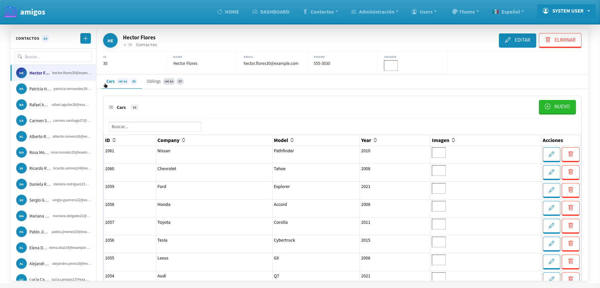

# pos



A parameter-driven Clojure web framework. Application behavior is controlled entirely by EDN configuration files in `resources/entities/`. Edit a config file and refresh the browser — no server restart required during development.

> **👋 For new developers:** This framework lets you build database-driven web apps by editing configuration files — no need to write backend code for basic features. If you know basic SQL (database queries) and can edit text files, you can be productive from day one. See [Before You Start](#before-you-start) for what you need installed.

---

## Table of Contents

- [Before You Start](#before-you-start)
- [Quick Start](#quick-start)
- [Project Structure](#project-structure)
- [Configuration Reference](#configuration-reference)
- [Database Commands](#database-commands)
- [Development Commands](#development-commands)
- [Entity Configuration](#entity-configuration-the-core-of-the-framework)
- [Adding an Entity](#adding-an-entity)
- [Included Example Entities](#included-example-entities)
- [Custom MVC Handlers](#custom-mvc-handlers)
- [Manual Routes](#manual-routes)
- [Menu Customization](#menu-customization)
- [Creating a Report](#creating-a-report)
- [Creating a User and Assigning a Temporary Password](#creating-a-user-and-assigning-a-temporary-password)
- [Lifecycle Hooks](#lifecycle-hooks)
- [Audit Trail](#audit-trail-who-did-what-and-when)
- [TabGrid Interface](#tabgrid-interface)
- [Internationalization (i18n)](#internationalization-i18n)
- [Entity Dashboards (Auto-Generated)](#entity-dashboards-auto-generated)
- [Full Tutorial: Building a Pizza Delivery App](#full-tutorial-building-a-pizza-delivery-app)
- [Cheat Sheet](#cheat-sheet-experienced-devs)
- [Troubleshooting](#troubleshooting)
- [License](#license)

---

## Before You Start

You need these tools installed on your computer:

| Tool | What it is | Where to get it |
|---|---|---|
| **Java 11+** | The runtime that runs Clojure code | [adoptium.net](https://adoptium.net) |
| **Leiningen** (`lein`) | Clojure's build tool (like `npm` for Node or `pip` for Python) | [leiningen.org](https://leiningen.org) |

Check they work by running these commands in your terminal:

```bash
java -version
lein version
```

If you see version numbers, you're ready to go.

### Key concepts you'll see in this guide

| Term | What it means |
|---|---|
| **EDN** | Clojure's configuration format (like JSON but with `:` prefixes on keys). You write entity configs in `.edn` files. |
| **Entity** | A database table and all its configuration (fields, permissions, menus). One `.edn` file = one entity. |
| **SQL** | The language databases speak. You'll write simple SQL queries for your entities. |
| **Migration** | A SQL file that creates or changes a database table. |
| **CRUD** | **C**reate, **R**ead, **U**pdate, **D**elete — the four basic operations on a database record. |
| **FK** | Foreign Key — a column that links one table to another (e.g., `department_id` links an employee to a department). |
| **Parameter-driven** | The engine reads your config files and auto-generates the admin UI. You don't write HTML or JavaScript. |

## Quick Start

### 1. Create a new project

Open a terminal and run these commands one by one:

```bash
git clone https://github.com/<user>/pos.git
cd pos
lein setup my-project
cd my-project
lein with-profile dev run
```

**What this does:** It copies the framework into a new folder called `my-project/`, sets up the database with example tables, creates default user accounts, and starts the development web server.

> 💡 **Tip:** Replace `my-project` with your project name. To put it somewhere specific: `lein setup /path/to/my-project`

### 2. Open the app in your browser

Once the server is running, open `http://localhost:3000` in your browser. Log in with one of these accounts:

| Email | Password | Level | What they can do |
|---|---|---|---|---|
| `user@example.com` | `user` | **U** (User) | View records only |
| `admin@example.com` | `admin` | **A** (Admin) | Create, view, edit, delete records |
| `system@example.com` | `system` | **S** (System) | Everything |

> **Change all passwords before deploying to production.**

### 3. How development works

The dev server **hot-reloads** your changes automatically. This means:
- Edit any configuration file in `resources/entities/`
- Wait 2 seconds or refresh your browser
- Your changes appear immediately — **no server restart needed**

Hot-reload also applies to hook files (business logic files in `src/your-project/hooks/`).

To force an immediate reload without waiting:

```bash
# In your browser, visit:
http://localhost:3000/admin/reload-config

# Or from the REPL:
```

```clojure
(require '[my-project.engine.config :as config])
(config/reload-all!)
```

---

## Project Structure (Where Things Go)

Here's a tour of the files and folders in your generated project. You'll mostly work in `resources/` and occasionally in `src/`.

```
resources/                          ← Files you edit most often
  entities/                           Entity configs (.edn files, one per database table)
  migrations/                         Database migration files (SQL to create/change tables)
  config/
    app-config.edn                    Main app settings (database, email, themes, etc.)
  i18n/
    en.edn                            English labels/translations
    es.edn                            Spanish labels/translations
  public/                             Images, CSS, and JavaScript files

src/<project-name>/
  core.clj                            App startup — wires everything together
  layout.clj                          Page layout (header, nav bar, footer, theme)
  menu.clj                            **Menu customization** — add/edit nav links and dropdowns
  hooks/                              Business logic files (one per entity, optional)
  routes/
    routes.clj                        **Public routes** — pages anyone can visit (login, etc.)
    proutes.clj                       **Protected routes** — pages that need login
  handlers/                           Custom page handlers (for pages beyond basic CRUD)
  engine/                             Framework internals (you rarely touch these)

target/                               Compiled code (auto-generated, ignore it)
test/                                 Unit tests
```

**Your workflow as a developer:**

1. Create a database table → write a migration in `resources/migrations/`
2. Configure the admin UI → create/edit an `.edn` file in `resources/entities/`
3. Add custom business logic → write a hook in `src/<project>/hooks/`
4. Build custom pages → create a handler in `src/<project>/handlers/`
5. Add nav links → edit `src/<project>/menu.clj`

---

## Configuration Reference (app-config.edn)

This is your main app settings file at `resources/config/app-config.edn`. You only need to change a few values to get started — most defaults work out of the box. Here's the full file with explanations:

```clojure
{:app {:session-timeout 28800                    ; 8 hours in seconds
       :default-locale :es
       :cookie-name "LS"
       :max-file-size-mb 5
       :grid-display-limit 7
       :pagination-size 25}

 :database {:error-codes
            {:postgres {:unique "23505" :fk "23503" :not-null "23502"}
             :mysql    {:unique 1062    :fk 1451   :not-null 1048}
             :sqlite   {:unique "UNIQUE constraint failed"
                        :fk "foreign key constraint failed"}}
            :connection-params
            {:mysql    {:use-ssl false :server-timezone "UTC"}
             :postgres {:sslmode "disable"}
             :sqlite   {}}}

 :ui {:themes ["cerulean" "cosmo" "darkly" "flatly" "sandstone" "sketchy" ...]
      :default-theme "sandstone"}

 :security {:csrf-token-name "anti-forgery-token"
            :session-secret-key "rs-session-key"
            :allowed-file-types ["image/jpeg" "image/png" "image/gif" "application/pdf"]
            :max-login-attempts 5
            :lockout-duration 900}

 :routes {:login "/home/login"
          :logout "/home/logoff"
          :password-change "/change/password"
          :admin-prefix "/admin"
          :api-prefix "/api"
          :upload-prefix "/uploads"}

 :roles {:hierarchy ["S" "A" "U"]
         :labels {"S" "System" "A" "Administrator" "U" "User"}
         :permissions {:S [:all]
                       :A [:create :read :update :delete]
                       :U [:read]}}

 :connections {:sqlite   {:db-type "sqlite"
                          :db-class "org.sqlite.JDBC"
                          :db-name "db/my-project.sqlite"}
               :mysql    {:db-type "mysql"
                          :db-class "com.mysql.cj.jdbc.Driver"
                          :db-name "//localhost:3306/my-project"
                          :db-user "root"
                          :db-pwd "change_me"}
               :postgres {:db-type "postgresql"
                          :db-class "org.postgresql.Driver"
                          :db-name "//localhost:5432/my-project"
                          :db-user "postgres"
                          :db-pwd "change_me"}
               :main :sqlite         ; Used for migrations (lein migrate)
               :default :sqlite}     ; Used by the application

 :site-name    "my-project"
 :company-name "change_me"
 :port         3000
 :tz           "US/Pacific"
 :base-url     "http://localhost:3000/"
 :img-url      "http://localhost:3000/uploads/"
 :path         "/uploads/"
 :uploads      "./uploads/my-project/"
 :max-upload-mb 5
 :allowed-image-exts ["jpg" "jpeg" "png" "gif" "bmp" "webp"]

 :email-host   "change_me"   ; smtp.provider.com
 :email-port   465
 :email-user   "change_me"   ; sender@example.com
 :email-passwd "change_me"   ; the SMTP password
 :email-ssl    true}
```

Only three keys must change per environment: `:default` (app DB), `:main` (migration DB), and the corresponding connection detail under the connection name.

---

## Database Commands

These are commands you run in your project folder to manage the database:

| Command | What it does |
|---|---|
| `lein migrate` | Apply any new migration files to your database |
| `lein rollback` | Undo the last migration (reverts the last change) |
| `lein database` | Fill the database with starter data (default users, examples) |
| `lein convert-migrations mysql` | Convert your SQLite migrations to MySQL format |
| `lein convert-migrations postgresql` | Convert your SQLite migrations to PostgreSQL format |
| `lein copy-data mysql` | Copy all your data from SQLite to a MySQL database |
| `lein copy-data postgresql` | Copy all your data from SQLite to a PostgreSQL database |

### Migrations (Database Version Control)

A **migration** is a SQL file that makes a change to your database (create a table, add a column, etc.). Migration files live in `resources/migrations/` and work in pairs:

```
resources/migrations/
  001-users.sqlite.up.sql              ← Creates the users table
  001-users.sqlite.down.sql            ← Reverses it (drops the table)
  002-users_view.sqlite.up.sql
  002-users_view.sqlite.down.sql
  ...
```

**Rules:**
- Each migration needs both an `.up.sql` (apply) and `.down.sql` (undo) file
- The number prefix (`001`, `002`...) controls the order they run
- The `.sqlite` part means "this is for SQLite" — the framework can convert to MySQL/PostgreSQL format automatically

**Example migration** (`001-users.sqlite.up.sql`):

```sql
CREATE TABLE IF NOT EXISTS users (
  id         INTEGER PRIMARY KEY AUTOINCREMENT,
  firstname  TEXT NOT NULL,
  lastname   TEXT NOT NULL,
  username   TEXT NOT NULL UNIQUE,
  password   TEXT NOT NULL,
  email      TEXT,
  level      TEXT DEFAULT 'U',
  active     TEXT DEFAULT 'T',
  created_at TEXT DEFAULT (datetime('now'))
);
```

**Example rollback** (`001-users.sqlite.down.sql`):

```sql
DROP TABLE IF EXISTS users;
```

### Switching to MySQL/PostgreSQL

1. Write migrations as `.sqlite.up.sql` / `.sqlite.down.sql`.
2. Run `lein convert-migrations mysql` to generate `.mysql.up.sql` / `.mysql.down.sql` files.
3. Change `:main :sqlite` to `:main :mysql` in `app-config.edn`.
4. Change `:default :sqlite` to `:default :mysql`.
5. Update the `:mysql` connection block with your host/credentials.
6. Run `lein migrate`.

To copy existing data: `lein copy-data mysql` (uses topological sort for FK dependencies).

---

## Development Commands

These are the most common `lein` commands you'll use:

| Command | What it does |
|---|---|
| `lein with-profile dev run` | Start the dev server (hot-reload enabled — edit files, refresh browser) |
| `lein run` | Start the production server (no hot-reload) |
| `lein test` | Run all unit tests |
| `lein compile` | Check your code for errors and compile it |
| `lein setup <name>` | Generate a new project from the framework template, run migrations, seed data |
| `lein clean-demo` | Remove the library demo entities, handlers, hooks, and migrations from your project |
| `lein uberjar` | Build a standalone `.jar` file for deployment |
| `lein repl` | Start an interactive Clojure REPL (advanced) |

### Deploying to Production

```bash
lein uberjar                                    # Build the package
java -jar target/uberjar/my-project-0.1.0-standalone.jar   # Run it
```

---

## Entity Configuration (The Core of the Framework)

Every database table you want to manage through the admin UI gets a **configuration file** in `resources/entities/`. These `.edn` files tell the engine:

- What **fields** the table has (name, type, whether required)
- What **SQL queries** to use for listing and editing records
- Who has **permission** to view or edit
- Where it appears in the **menu**
- What **relationships** it has with other tables (subgrids)
- Any custom **business logic** (hooks)

The engine reads these files and auto-generates the admin interface — **no code needed for basic CRUD**.

### Minimal Entity

```clojure
{:entity     :products
 :title      "Products"
 :table      "products"
 :connection :default
 :rights     ["U" "A" "S"]
 :menu-category :Inventory

 :fields [{:id :id    :type :hidden}
          {:id :name  :label "Name"  :type :text    :required? true}
          {:id :price :label "Price" :type :decimal :min 0 :step 0.01}]

 :queries {:list "SELECT * FROM products ORDER BY name"
           :get  "SELECT * FROM products WHERE id = ?"}

 :actions {:new true :edit true :delete true}}
```

### Full Entity with All Options (Reference Example)

This example shows every field type and configuration option available. You don't need to use all of them — start with the [Minimal Entity](#minimal-entity) above and add options as needed.

```clojure
{:entity     :employees
 :title      "Employees"
 :table      "employees"
 :connection :default
 :rights     ["A" "S"]              ; Only Admin and System users
 :mode       :parameter-driven      ; :parameter-driven | :generated | :hybrid
 :menu-category :HR
 :menu-order    10
 :menu-icon     "bi bi-people"
 :menu-hidden  false                ; true = hide from main menu (subgrids only)

 :fields [{:id :id         :type :hidden}

          ;; TEXT — single-line string input
          {:id :firstname  :label "First Name"  :type :text :placeholder "First name..."
           :required? true :validation :my-proj.hooks.employees/validate-name}

          ;; EMAIL — text input with email type attribute
          {:id :email      :label "Email" :type :email :placeholder "user@example.com"}

          ;; PASSWORD — password input (masked). If included in entity, the engine
          ;; auto-hashes on save using buddy.hashers. Typically excluded from CRUD
          ;; forms — use the "Create Temporary Password" flow instead (see below).
          {:id :password   :label "Password" :type :password}

          ;; NUMBER — integer input (HTML number)
          {:id :age        :label "Age" :type :number :min 18 :max 120}

          ;; DECIMAL — floating point input
          {:id :salary     :label "Salary" :type :decimal :min 0 :step 0.01}

          ;; DATE — date picker (HTML5 input type=date)
          {:id :hire_date  :label "Hire Date" :type :date}

          ;; DATETIME — datetime picker (HTML5 input type=datetime-local)
          {:id :last_login :label "Last Login" :type :datetime}

          ;; TEXTAREA — multiline text input
          {:id :notes      :label "Notes" :type :textarea :placeholder "Additional notes..."}

          ;; SELECT — dropdown (single choice). Use :options for static choices,
          ;; or :query for dynamic options from the database.
          {:id :department_id :label "Department" :type :select
           :options [{:value "" :label "Select Department"}
                     {:value "1" :label "Engineering"}
                     {:value "2" :label "Sales"}
                     {:value "3" :label "Marketing"}]}

          ;; FK — foreign key select (dynamic options from referenced entity).
          ;; Use :fk with the entity keyword. :fk-field can be a keyword or
          ;; a vector of keywords for composite display (e.g. [:first_name :last_name]).
          {:id :department_id :label "Department" :type :fk
           :fk :departments              ; Referenced entity keyword
           :fk-field [:name]             ; Display field(s) from referenced entity
           :fk-can-create? true          ; Show "+" button to create inline via modal
           :hidden-in-grid? true}        ; Hide FK ID in grid (show display name)
          ;; Display-only field on grid (must be aliased in :queries :list)
          {:id :department_nombre :label "Department" :grid-only? true}

          ;; FK with composite display name
          {:id :manager_id :label "Manager" :type :fk
           :fk :employees
           :fk-field [:first_name :last_name]
           :fk-can-create? true
           :hidden-in-grid? true}
          {:id :employee_nombre :label "Manager" :grid-only? true}

          ;; DEPENDENT FK — second dropdown filtered by the parent FK value.
          ;; :fk-parent is the field name (keyword) in the same entity whose
          ;; selected value drives the filter.
          {:id :municipio_id :label "Municipio" :type :fk
           :fk :municipios
           :fk-field :nombre
           :fk-parent :estado_id
           :fk-can-create? true}

          ;; FK WITH FILTER — static filter applied to all FK dropdown queries.
          ;; A vector of [field value] that adds WHERE field = value to the
          ;; FK options query.
          {:id :department_id :label "Department" :type :fk
           :fk :departments
           :fk-field :name
           :fk-filter [:active "T"]}

          ;; RADIO — single choice (horizontal buttons)
          {:id :active     :label "Active" :type :radio :value "T"
           :options [{:id "activeT" :value "T" :label "Active"}
                     {:id "activeF" :value "F" :label "Inactive"}]}

          ;; CHECKBOX — single boolean toggle
          {:id :is_manager :label "Is Manager" :type :checkbox}

          ;; FILE — file upload. Automatically saves to :uploads directory.
          ;; Use hooks for custom file processing (resize, rename, etc.)
          {:id :avatar     :label "Avatar" :type :file}

          ;; COMPUTED — calculated field (not stored, read-only in grid)
          {:id :full_name  :label "Full Name" :type :computed
           :compute-fn :my-proj.hooks.employees/full-name}

          ;; HIDDEN — not displayed in forms or grids
          {:id :created_by :label "Created By" :type :hidden}]

 ;; QUERIES — custom SQL for list and single-record views.
 ;; :list is used for the grid view, :get for the edit form.
 :queries {:list "SELECT e.*, d.name AS department_name
                  FROM employees e
                  LEFT JOIN departments d ON e.department_id = d.id
                  ORDER BY e.lastname"
           :get  "SELECT e.*, d.name AS department_name
                  FROM employees e
                  LEFT JOIN departments d ON e.department_id = d.id
                  WHERE e.id = ?"}

 ;; ACTIONS — toggle record-level operations
 :actions {:new    true     ; Show "New Record" button
           :edit   true     ; Show "Edit" button per row
           :delete true}    ; Show "Delete" button per row (with confirmation)

 ;; AUDIT — automatically track who created/modified records and when.
 ;; Requires audit_log table (migration 006-audit_log).
 :audit? true

 ;; HOOKS — lifecycle functions called at specific points.
 ;; Each hook receives the params/row map and returns a (possibly modified) map.
 :hooks {:before-load  :my-proj.hooks.employees/before-load   ; before query
         :after-load   :my-proj.hooks.employees/after-load    ; after query
         :before-save  :my-proj.hooks.employees/before-save   ; before insert/update
         :after-save   :my-proj.hooks.employees/after-save    ; after insert/update
         :before-delete :my-proj.hooks.employees/before-delete ; before delete
         :after-delete  :my-proj.hooks.employees/after-delete} ; after delete

 ;; SUBGRIDS — child entities displayed as tabs on the edit form.
 ;; :foreign-key is the FK column in the child table.
 ;; :relationship-type can be :one-to-one, :one-to-many, or :many-to-many.
 ;; For :many-to-many, also set :through-table, :related-entity, and :related-fk.
 :subgrids [{:entity      :employee_profiles
             :title       "Profile"
             :foreign-key :employee_id
             :icon        "bi bi-person-badge"
             :label       "Profile"
             :relationship-type :one-to-one}
            {:entity      :employee_projects
             :title       "Projects"
             :foreign-key :employee_id
             :icon        "bi bi-briefcase"
             :label       "Projects"
             :relationship-type :many-to-many
             :through-table :employee_projects
             :related-entity :projects
             :related-fk :project_id}]}
```

### Complete Entity Config Spec

Every entity EDN is validated against this spec:

| Key | Required | Type | Description |
|---|---|---|---|
| `:entity` | yes | keyword | Unique entity identifier (e.g., `:products`) |
| `:title` | yes | string | Display title for UI |
| `:table` | yes | string | Database table name |
| `:connection` | no | keyword | Connection key (`:default`, `:mysql`, `:pg`). Defaults to `:default` |
| `:rights` | no | `[string]` | Allowed user levels. Defaults to `["U" "A" "S"]` |
| `:mode` | no | keyword | `:parameter-driven` (default), `:generated`, or `:hybrid` |
| `:menu-category` | no | keyword | Group in the nav menu |
| `:menu-order` | no | number | Sort order in the menu |
| `:menu-icon` | no | string | Bootstrap icon class (e.g., `"bi bi-people"`) |
| `:dropdown-icon` | no | string | Dropdown icon for menu |
| `:menu-hidden` | no | boolean | Hide from menu (for subgrid-only entities). Uses `:menu-hidden true` (not `:menu-hidden?`) |
| `:fields` | no | `[field]` | Field definitions (see below) |
| `:queries` | no | map | `{:list <sql> :get <sql>}` — custom SQL queries |
| `:actions` | no | map | `{:new <bool> :edit <bool> :delete <bool>}` |
| `:audit?` | no | boolean | Enable audit trail |
| `:hooks` | no | map | `{:before-save <fn-ref> :after-load <fn-ref> ...}` |
| `:subgrids` | no | `[subgrid]` | Child entity configuration |

### Field Spec

Each field supports:

| Key | Required | Type | Description |
|---|---|---|---|
| `:id` | yes | keyword | Field identifier (matches DB column) |
| `:label` | yes | string | Display label |
| `:type` | yes | keyword | One of: `:text`, `:email`, `:password`, `:date`, `:datetime`, `:number`, `:decimal`, `:select`, `:radio`, `:checkbox`, `:textarea`, `:file`, `:pdf`, `:document`, `:hidden`, `:computed`, `:fk` |
| `:required?` | no | boolean | Mark field as required |
| `:placeholder` | no | string | Placeholder text |
| `:value` | no | any | Default value |
| `:options` | no | `[{:value <str> :label <str>}]` | Options for select/radio fields |
| `:validation` | no | keyword/fn | Custom validation function |
| `:compute-fn` | no | keyword/fn | Computed field function (for `:computed` type) |
| `:fk` | no | keyword | Referenced entity keyword (used with `:type :fk`). E.g., `:departments` |
| `:fk-field` | no | keyword or vec | Display column(s) from the FK entity. Single: `:name`, composite: `[:first_name :last_name]` |
| `:fk-parent` | no | keyword | Parent field keyword for dependent FK selects. E.g., `:estado_id` |
| `:fk-filter` | no | `[field value]` | Static filter on FK options. E.g., `[:active "T"]` adds `WHERE active = ?` |
| `:fk-can-create?` | no | boolean | Show "+" button to create FK record inline via modal |
| `:hidden-in-grid?` | no | boolean | Hide FK ID in grid (show display name from `:grid-only?` field instead) |
| `:hidden-in-form?` | no | boolean | Hide in forms (for grid-only fields) |
| `:grid-only?` | no | boolean | Only show in grid, never in form (used for display aliases from SQL) |
| `:min` / `:max` | no | number | Min/max for number and decimal fields |
| `:step` | no | number | Step increment for decimal |

---

## Adding an Entity

### Scaffold from an existing database table

```bash
lein scaffold products
```

This introspects the `products` table in the database and generates:
- `resources/entities/products.edn` — full entity config with auto-detected field types, FKs, and subgrids
- `src/<project>/hooks/products.clj` — lifecycle hook stub

The scaffold engine auto-detects:
- **SQL type → field type** (e.g., `VARCHAR` → `:text`, `INT` → `:number`, `DECIMAL` → `:decimal`, `DATE` → `:date`, `TEXT` → `:textarea`)
- **Convention-based recognition** (column named `email` → `:email`, `password` → `:password`, `imagen`/`image`/`photo` → `:file`, etc.)
- **Foreign keys** (columns ending in `_id`) → `:select` with `:foreign-key` metadata
- **Subgrids** (reverse FK lookup in other tables) → auto-populates `:subgrids`
- **Relationship type** (1:1, 1:N, M:N) via unique index analysis
- **Junction tables** (composite PK with two FK columns) → many-to-many support

#### What `--force` does

```bash
lein scaffold products --force
```

By default, scaffold **safely updates existing files** — it adds any new fields or subgrids it finds but leaves your custom changes alone. Use `--force` to overwrite everything:

| What | Without `--force` (default — safe) | With `--force` (⚠️ overwrites) |
|---|---|---|
| **Entity EDN** (`resources/entities/products.edn`) | Adds new fields/subgrids only. Your custom `:queries`, `:hooks`, `:menu-category`, etc. stay as-is. | **Overwrites** the whole file. All your custom edits are lost. |
| **Hook file** (`src/<project>/hooks/products.clj`) | **Skipped** with a warning if the file already exists. Your custom code is untouched. | **Regenerated** from scratch. All your custom hook code is lost. |

**Use `--force` when:**
- You renamed database columns and the entity config needs to match
- You deleted and recreated a table with different columns
- You want a completely fresh start

**Skip `--force` (safe mode) when:**
- You've added custom SQL queries, hooks, or menu settings you want to keep
- You only added a new column to the table and want it merged in

### Scaffold all tables at once

```bash
lein scaffold --all
```

Scaffolds every non-system table. Idempotent — already-scaffolded tables are merged with new subgrids without losing customisations.

```bash
lein scaffold --all --force    # Overwrite every entity EDN and regenerate all hooks
```

### Other scaffold options

```bash
lein scaffold products --no-hooks          # Skip hook stub generation
lein scaffold products --rights [A S]      # Set user rights
lein scaffold products --title "Products"  # Custom display title
lein scaffold employees --conn :pg         # Use a different database connection
lein scaffold --all --exclude sessions,schema_migrations   # Skip certain tables
```

### Create manually (step by step)

**Step 1: Write a migration file** — this creates your database table. Create two files in `resources/migrations/`:

```sql
-- 001-products.sqlite.up.sql    ← Creates the table
CREATE TABLE IF NOT EXISTS products (
  id      INTEGER PRIMARY KEY AUTOINCREMENT,
  name    TEXT NOT NULL,
  price   REAL DEFAULT 0.0,
  active  TEXT DEFAULT 'T'
);
```

```sql
-- 001-products.sqlite.down.sql  ← Reverses the creation (for rollback)
DROP TABLE IF EXISTS products;
```

> 💡 **Naming rule:** Each migration needs `.up.sql` (to create) and `.down.sql` (to undo). The number (`001`, `002`...) determines the order they run.

**Step 2: Apply the migration** to your database:

```bash
lein migrate
```

**Step 3: Create the entity config file** at `resources/entities/products.edn`. Start with the [Minimal Entity](#minimal-entity) example above.

**Step 4: Refresh your browser** — the new entity appears in the admin menu with full Create/Read/Update/Delete.

---

## Included Example Entities

These are defined by the migrations in `resources/migrations/` and pre-configured as entity EDNs in `resources/entities/`.

### Users (`001-users`, `resources/entities/users.edn`)
- Columns: `id`, `lastname`, `firstname`, `username`, `password`, `dob`, `cell`, `phone`, `fax`, `email`, `level`, `active`, `imagen`, `last_login`
- Three seed users: `user@example.com`/`user` (level `U`), `admin@example.com`/`admin` (level `A`), `system@example.com`/`system` (level `S`)
- Access restricted to Admins and System (`:rights ["A" "S"]`). Password field excluded from CRUD forms — use the temp-password flow instead.
- Lifecycle hooks handle file upload if the `:imagen` field is uncommented.

### Users View (`002-users_view`)
- Creates a database view (`users_view`) with formatted fields for reports.

### Audit Log (`006-audit_log`)
- Tracks record changes when `:audit? true` is set on an entity config.

### Library Demo System (`008-015` — Biblioteca)

A complete library management system demonstrating every framework feature. Grouped under the **Biblioteca** menu category.

| Migration | Entity | Description | Key Features |
|---|---|---|---|
| `008-autores` | `autores.edn` | Book authors | `:text`, `:textarea`, `:radio` fields |
| `009-categorias` | `categorias.edn` | Book categories | `:text`, `:textarea` fields |
| `010-libros` | **`libros.edn`** | Books — flagship entity | **`:file`**, **`:pdf`**, **`:document`** uploads, `:fk` to categorias, subgrids (imagenes, autores), custom hooks for file processing |
| `011-libros_imagenes` | `libros_imagenes.edn` | Gallery images (subgrid of libros) | `:file` upload, `:menu-hidden true` |
| `012-libros_autores` | `libros_autores.edn` | Many-to-many junction (libros ↔ autores) | `:many-to-many` subgrid with `:through-table`, `:menu-hidden true` |
| `013-miembros` | `miembros.edn` | Library members | `:email`, `:file` (photo), `:date`, `:checkbox` fields |
| `014-prestamos` | `prestamos.edn` | Loan headers with FK to miembros | `:date`, `:radio` (status), `:fk` to miembros, subgrid with prestamos_detalle |
| `015-prestamos_detalle` | `prestamos_detalle.edn` | Loan line items (subgrid of prestamos) | `:fk` to libros with composite display `[:titulo :isbn]`, `:menu-hidden true` |

All use `:mode :parameter-driven`, `:connection :default`, and `:rights ["U" "A" "S"]`.

#### Custom Handlers (MVC)

The library demo also includes two custom MVC handler sets (the 20% senior-written code):

| Handler | Description |
|---|---|
| `handlers/prestamos/` | Loan desk — search members, check out books, manage returns with a tailored UI |
| `handlers/reportes/` | Library reports — `build-report` views for libros, miembros, and prestamos with sort/search/export |

#### Cleaning Up the Demo

When you are ready to remove the library demo from your project:

```bash
lein clean-demo
```

This deletes migration files 008-015, the 8 entity EDN files, 2 hook files, 2 handler directories (`prestamos/`, `reportes/`), uploaded photos/PDFs, and edits routes, menu, and i18n files — but does **not** touch the database itself. After running `clean-demo`, drop and recreate your database, create your own migrations, and run:

```bash
lein migrate && lein database && lein seed-non-users localdb
```

The audit_log table and seed data are preserved so the audit trail system works out of the box.

---

## Custom Page Handlers (MVC)

The parameter-driven engine handles basic CRUD automatically, but when you need a custom page (like a dashboard, a phone-order screen, or a kitchen display board), you build a **handler**. Each handler has three files that work together:

| File | What it does | Analogy |
|---|---|---|
| **Controller** (`controller.clj`) | Receives the web request, calls the model, sends the result to the view | Like a restaurant host — seats customers (routes requests) |
| **Model** (`model.clj`) | Fetches data from the database | Like the kitchen — prepares the food (data) |
| **View** (`view.clj`) | Renders HTML for the browser | Like the plating chef — makes it look good |

This is called the **MVC pattern** (Model-View-Controller). Don't worry if that sounds fancy — the framework keeps it simple.

### Generating a Handler Skeleton

```bash
lein gen-handler reports
```

This creates:
```
src/<project>/handlers/reports/
  controller.clj    — HTTP request handler
  model.clj          — Data access (queries)
  view.clj           — HTML rendering via Hiccup
```

And automatically adds the require to `src/<project>/routes/proutes.clj`.

To remove:

```bash
lein gen-handler reports remove
```

### Handler Structure

#### Controller (`controller.clj`)

The controller receives the incoming web request, asks the model for data, passes it to the view to generate HTML, then wraps the page in the app's layout (nav bar, footer, theme).

```clojure
(ns my-project.handlers.reports.controller
  (:require
   [my-project.handlers.reports.model :as model]
   [my-project.handlers.reports.view :as view]
   [my-project.layout :refer [application]]
   [my-project.models.util :refer [get-session-id]]))

(defn contactos
  [request]
  (let [title "Reporte de contactos"
        ok (get-session-id request)   ; 0 = not logged in, >0 = user ID
        js nil                        ; optional JavaScript to inject
        rows (model/get-contactos)
        content (view/contactos request title rows)]
    (application request title ok js content)))
```

The `application` function from `layout.clj` wraps content in the full HTML page (nav bar, footer, theme). Its signature is:

```clojure
(application request title ok js content)
```

- `request` — the incoming web request (contains browser info, form data, etc.)
- `title` — page title (shown in the browser tab)
- `ok` — user ID (0 = not logged in, >0 = logged in)
- `js` — optional extra JavaScript to add to the page
- `content` — the HTML for the page body (generated by the view)

#### Model (`model.clj`)

The model contains SQL queries and data access functions using `Query` from `models.crud`:

```clojure
(ns my-project.handlers.reports.model
  (:require
   [my-project.models.crud :refer [Query]]))

(def ^:private contactos-sql
  "SELECT con.*,
          (SELECT group_concat(name, ', ') FROM siblings WHERE contacto_id = con.id) AS siblings,
          (SELECT group_concat(company || ' ' || model || ' ' || year, ', ')
             FROM cars WHERE contacto_id = con.id) AS cars
   FROM contactos con
   ORDER BY con.name")

(def ^:private users-sql
  "SELECT * FROM users_view")

(defn get-contactos []
  (Query contactos-sql))

(defn get-users []
  (Query users-sql))
```

#### View (`view.clj`)

The view renders HTML using **Hiccup** — a Clojure way of writing HTML using vectors (square brackets `[...]`). For example, `[:h1 "Hello"]` becomes `<h1>Hello</h1>`. For report tables, use the ready-made `build-report` function from `models.grid` — it handles sorting, searching, and export buttons for you:

```clojure
(ns my-project.handlers.reports.view
  (:require
   [my-project.models.grid :refer [build-report]]))

(def ^:private contactos-fields
  (array-map
   :name           "Nombre"
   :phone          "Telefono"
   :email          "Email"
   :estado_nombre  "Estado"
   :municipio_nombre "Municipio"
   :colonia_nombre "Colonia"
   :siblings       "Hermanos"
   :cars           "Automobiles"))

(defn contactos
  [request title rows]
  (build-report request title rows "contactos-report" contactos-fields))
```

The `build-report` function:
- Renders a read-only table with sortable columns
- Includes search/filter bar
- Provides CSV export (`?export=csv`), PDF export (`?export=pdf`), and Print buttons
- Adds `@media print` CSS for clean print output
- Auto-detects `?search=`, `?sort-by=`, `?sort-order=` query parameters

The full `build-report` function accepts a few advanced options as well:

```clojure
(build-report request title rows table-id fields & [page-info current-params])
```

Don't worry about the extra parameters — for simple reports, the 5-parameter version shown above is all you need.

### Generating Custom Route Registrations

When you use `lein gen-handler <name>`, the tool automatically adds a require and route to `proutes.clj`. You must manually add the route handler call. Edit `src/<project>/routes/proutes.clj`:

```clojure
(ns my-project.routes.proutes
  (:require
   [compojure.core :refer [defroutes GET]]
   [my-project.handlers.dashboard.controller :as dashboard]
   [my-project.handlers.reports.controller :as reports]))  ;; ← auto-added

(defroutes proutes
  (GET "/dashboard" req (dashboard/main req))
  (GET "/reports/contactos" req (reports/contactos req))   ;; ← add this
  (GET "/reports/users" req (reports/users req)))           ;; ← add this
```

---

## Manual Routes (Connecting URLs to Pages)

A **route** tells the app: "When someone visits this URL, run this code." Routes live in two files under `src/<project>/routes/`:

- **`routes.clj`** — pages that anyone can visit (login page, etc.)
- **`proutes.clj`** — pages that require a login (protected)

### Public Routes (`routes.clj`) — No Login Needed

```clojure
(ns my-project.routes.routes
  (:require
   [compojure.core :refer [defroutes GET POST]]
   [my-project.handlers.home.controller :as home-controller]))

(defroutes open-routes
  (GET "/" params [] (home-controller/main params))
  (GET "/home/login" params [] (home-controller/login params))
  (POST "/home/login" params [] (home-controller/login-user params))
  (GET "/home/logoff" params [] (home-controller/logoff-user params)))

(defroutes password-routes
  (GET "/change/password" params [] (home-controller/change-password params))
  (POST "/change/password" params [] (home-controller/process-password params))
  (GET "/home/temp-password" params [] (home-controller/temp-password params))
  (POST "/home/temp-password" params [] (home-controller/process-temp-password params)))
```

Add new public routes here. They are composed in `core.clj` with no auth middleware.

### Protected Routes (`proutes.clj`)

Authentication required. The `wrap-login` middleware (applied in `core.clj`) redirects unauthenticated users to the login page:

```clojure
(ns my-project.routes.proutes
  (:require
   [compojure.core :refer [defroutes GET]]
   [my-project.handlers.dashboard.controller :as dashboard]
   [my-project.handlers.reports.controller :as reports]))

(defroutes proutes
  (GET "/dashboard" req (dashboard/main req))
  (GET "/reports/contactos" req (reports/contactos req))
  (GET "/reports/users" req (reports/users req)))
```

### Dynamic Engine Routes

All parameter-driven CRUD routes are auto-generated by the engine in `engine/router.clj`:

| Route | Description |
|---|---|
| `GET /admin/:entity` | Grid list with search, sort, pagination, TabGrid |
| `GET /admin/:entity/add-form` | New record form |
| `GET /admin/:entity/add-form/:parent_id` | New record (subgrid context) |
| `GET /admin/:entity/edit-form/:id` | Edit record form |
| `POST /admin/:entity/save` | Create or update record |
| `POST /admin/:entity/delete/:id` | Delete record |
| `GET /admin/:entity/delete/:id` | Delete (GET, backward compat) |
| `GET /admin/:entity/subgrid` | Subgrid AJAX |
| `GET /admin/:entity/:id` | Grid view scrolled to record |
| `GET /dashboard/:entity` | Entity dashboard (supports `?export=csv` and `?export=pdf`) |
| `GET /admin/reload-config` | Hot-reload all entity configs |

Engine routes are composed in `core.clj` with login middleware:

```clojure
(wrap-login (wrap-routes (engine/get-routes)))
```

---

## Menu Customization

The navigation menu is assembled by `src/<project>/menu.clj`. It automatically creates dropdown groups from your entity configs and lets you add custom links. The three sections below show how to add your own menu items.

### Custom Nav Links

Add standalone nav links (no dropdown) for pages without a backing entity — custom handlers, dashboards, external URLs:

```clojure
;; src/<project>/menu.clj
(def custom-nav-links
  "Custom navigation links (non-dropdown, not entity-based)"
  [["/"          "HOME"      "bi bi-house"        nil 0]
   ["/dashboard" "DASHBOARD" "bi bi-speedometer2" "U" 10]
   ["/pedido"    "PEDIDO"    "bi bi-telephone"    "U" 20]
   ["/despacho"  "DESPACHO"  "bi bi-truck"        "U" 30]])
```

Each entry follows `["/path" "Label" "icon-class" "rights" order]`:

| Element | Description |
|---|---|
| `"/path"` | URL path |
| `"Label"` | Display text |
| `"icon-class"` (optional) | Bootstrap icon class, e.g. `"bi bi-house"`. Can appear in 3rd or 4th position — auto-detected by the `bi ` prefix |
| `"rights"` (optional) | User level: `nil` = everyone, `"U"` = Users+, `"A"` = Admins only |
| `order` (optional) | Sort order (lower = first). Defaults to `0` |

Supported shorthand forms: `["/" "HOME"]`, `["/" "HOME" "U"]`, `["/" "HOME" "U" 10]`, `["/" "HOME" "bi bi-house"]`, `["/" "HOME" "bi bi-house" 10]`.

### Custom Dropdown Menus

Create entirely new dropdown menu groups (not tied to any entity category):

```clojure
;; src/<project>/menu.clj
(def custom-dropdowns
  "Custom dropdown menus (not entity-based)"
  {:Reports
   {:id      "navdrop-reports"
    :data-id "Reports"
    :label   "Reports"
    :order   40
    :icon    "bi bi-printer"
    :items   [["/reports/contactos" "Contacts"  "U" 10 "bi bi-people"]
              ["/reports/users"     "Users"     "A" 50 "bi bi-people"]]}})
```

| Key | Description |
|---|---|
| `:label` | Dropdown display text |
| `:order` | Position among all dropdowns (lower = first) |
| `:icon` | Bootstrap icon for the dropdown toggle |
| `:items` | Vector of nav-link entries (same format as `custom-nav-links`) |

Each item in `:items` follows the same `["/path" "Label" "rights" order "icon"]` format as nav links.

### Adding Items to Existing Dropdowns

Append extra items to auto-generated entity dropdowns (or custom ones) without modifying the entity EDN:

```clojure
;; src/<project>/menu.clj
(def custom-dropdown-items
  "Extra items to append to existing dropdowns (auto-generated or custom).
   Maps a category keyword to items in [href label rights order icon] format."
  {:Users    [["/home/temp-password" "Temp Password" "A" 10 "bi bi-file-text"]]
   :Reports  [["/reports/orders" "Orders" "U" 60 "bi bi-receipt"]]})
```

The category keyword matches the `:menu-category` value from entity EDN files (`:Users`, `:Reports`, `:Catalogos`, etc.). Items are merged into the existing dropdown and sorted by `:order`.

### Entity-Level Menu Config

Entity EDN fields that affect menu placement (already documented in the [Field Spec](#field-spec)):

| Key | Description |
|---|---|
| `:menu-category` | Dropdown group (keyword). Entities with the same category appear in the same dropdown |
| `:menu-order` | Sort order within the dropdown |
| `:menu-icon` | Bootstrap icon for the nav link |
| `:dropdown-icon` | Icon override for the dropdown toggle when this entity defines the category |
| `:menu-hidden` | `true` = hide from menu (for subgrid-only entities) |

### Menu Refresh

Entity menus auto-refresh with config hot-reload (every 2s in dev). For custom nav links and dropdowns, a dev server restart is required, or call from the REPL:

```clojure
(require '[my-project.engine.menu :as menu])
(menu/refresh-menu!)
```<｜end▁of▁thinking｜>Now verify the TOC also needs a link. Let me update it:

<｜｜DSML｜｜tool_calls>
<｜｜DSML｜｜invoke name="read">
<｜｜DSML｜｜parameter name="offset" string="false">18

### Controller

`src/<project>/handlers/dashboard/controller.clj`:

```clojure
(ns my-project.handlers.dashboard.controller
  (:require
   [my-project.handlers.dashboard.model :as model]
   [my-project.handlers.dashboard.view :as view]
   [my-project.layout :refer [application]]
   [my-project.models.util :refer [get-session-id]]))

(defn main
  [request]
  (let [title "DASHBOARD"
        ok (get-session-id request)
        js nil
        stats (model/get-stats)
        content (view/main title stats)]
    (application request title ok js content)))
```

### Model

`src/<project>/handlers/dashboard/model.clj` uses `sqlite_master` to discover tables and runs parallel count queries with `pmap`:

```clojure
(ns my-project.handlers.dashboard.model
  (:require
   [my-project.models.crud :refer [Query]]))

(def ^:private tables-sql
  "SELECT name FROM sqlite_master
   WHERE type = 'table' AND name <> 'sqlite_sequence'")

(def ^:private tables
  (->> (Query tables-sql)
       (map :name)))

(defn- tt [table]
  (let [sql (str "SELECT COUNT(*) AS count FROM " table)
        k (keyword table)
        v (->> (Query sql) first :count)]
    [k v]))

(defn get-stats []
  (into (sorted-map) (pmap tt tables)))
```

For MySQL/PostgreSQL, replace `sqlite_master` with `information_schema.tables`.

### View

`src/<project>/handlers/dashboard/view.clj` renders a card for each table:

```clojure
(ns my-project.handlers.dashboard.view)

(defn- card [title count]
  [:div.col-12.col-sm-6.col-md-4.mb-2
   [:div.card
    [:div.card-body
     [:h5.card-title.text-primary title]
     [:p.card-text.fw-bolder count]]]])

(defn main [title stats]
  [:div.container.text-center.text-capitalize.bg-primary.w-50
   [:h1 title]
   [:div.row
    (map (fn [[k v]] (card (name k) v)) stats)]])
```

### Route Registration

Add the route in `src/<project>/routes/proutes.clj`:

```clojure
(GET "/dashboard" req (dashboard/main req))
```

### Add to Menu

The dashboard is not an entity-based page, so it needs a manual nav link in `src/<project>/menu.clj`:

```clojure
(def custom-nav-links
  [["/"          "HOME"      "bi bi-house"        nil 0]
   ["/dashboard" "DASHBOARD" "bi bi-speedometer2" "U" 10]])
```

See [Menu Customization](#menu-customization) for all menu configuration options.

### Entity-Specific Dashboards

The engine provides entity dashboards automatically at `GET /dashboard/:entity`. For example, `GET /dashboard/users` shows a grid of all users with search, sort, export (`?export=csv`, `?export=pdf`), and print. No code needed.

---

## Creating a Report

Reports are custom MVC handlers that display read-only data with sorting, searching, CSV export, PDF export, and print support. They use the shared `build-report` function from `models.grid`.

### Step 1: Generate the handler skeleton

```bash
lein gen-handler reports
```

This creates `src/<project>/handlers/reports/` with `controller.clj`, `model.clj`, `view.clj`.

### Step 2: Implement the Model

Write SQL queries that join related tables. The model returns a seq of maps:

```clojure
(ns my-project.handlers.reports.model
  (:require
   [my-project.models.crud :refer [Query]]))

(def contactos-sql
  "SELECT con.*,
          (SELECT GROUP_CONCAT(name, ', ') FROM siblings WHERE contacto_id = con.id) AS siblings,
          (SELECT GROUP_CONCAT(company || ' ' || model || ' ' || year, ', ')
             FROM cars WHERE contacto_id = con.id) AS cars,
          est.nombre AS estado_nombre,
          mun.nombre AS municipio_nombre,
          col.nombre AS colonia_nombre
   FROM contactos con
   LEFT JOIN estados est ON con.estado_id = est.id
   LEFT JOIN municipios mun ON con.municipio_id = mun.id
   LEFT JOIN colonias col ON con.colonia_id = col.id
   ORDER BY con.name")

(def users-sql
  "SELECT * FROM users_view")

(defn get-contactos [] (Query contactos-sql))
(defn get-users      [] (Query users-sql))
```

### Step 3: Implement the View

Define the column map (keyword → label) and call `build-report`:

```clojure
(ns my-project.handlers.reports.view
  (:require
   [my-project.models.grid :refer [build-report]]))

(def contactos-fields
  (array-map
   :name            "Nombre"
   :phone           "Telefono"
   :email           "Email"
   :estado_nombre   "Estado"
   :municipio_nombre "Municipio"
   :colonia_nombre  "Colonia"
   :siblings        "Hermanos"
   :cars            "Automobiles"))

(def users-fields
  (array-map
   :username         "Usuario"
   :firstname        "Nombre"
   :lastname         "Apellido"
   :dob_formatted    "Fecha de Nacimiento"
   :phone            "Telefono"
   :cell             "Celular"
   :level_formatted  "Nivel"
   :active_formatted "Status"))

(defn contactos [request title rows]
  (build-report request title rows "contactos-report" contactos-fields))

(defn users [request title rows]
  (build-report request title rows "users-report" users-fields))
```

> 💡 **Note:** `array-map` keeps columns in the order you write them. If you used a regular map (`{}`), Clojure might reorder them alphabetically instead.

### Step 4: Implement the Controller

```clojure
(ns my-project.handlers.reports.controller
  (:require
   [my-project.handlers.reports.model :as model]
   [my-project.handlers.reports.view :as view]
   [my-project.layout :refer [application]]
   [my-project.models.util :refer [get-session-id]]))

(defn contactos [request]
  (let [title "Reporte de contactos"
        ok (get-session-id request)
        js nil
        rows (model/get-contactos)
        content (view/contactos request title rows)]
    (application request title ok js content)))

(defn users [request]
  (let [title "Reporte de usuarios"
        ok (get-session-id request)
        js nil
        rows (model/get-users)
        content (view/users request title rows)]
    (application request title ok js content)))
```

### Step 5: Register the Routes

Edit `src/<project>/routes/proutes.clj`:

```clojure
(ns my-project.routes.proutes
  (:require
   [compojure.core :refer [defroutes GET]]
   [my-project.handlers.dashboard.controller :as dashboard]
   [my-project.handlers.reports.controller :as reports]))

(defroutes proutes
  (GET "/dashboard" req (dashboard/main req))
  (GET "/reports/contactos" req (reports/contactos req))
  (GET "/reports/users" req (reports/users req)))
```

### Step 6: Add to Menu

Reports are custom handlers (no entity EDN), so add a nav link or dropdown item in `src/<project>/menu.clj`. For standalone nav links:

```clojure
(def custom-nav-links
  [["/"                  "HOME"      "bi bi-house"        nil 0]
   ["/reports/contactos" "Contacts"  "bi bi-people"       "U" 10]
   ["/reports/users"     "Users"     "bi bi-people"       "A" 20]])
```

Or add them to an existing or custom dropdown — see [Menu Customization](#menu-customization) for all options.

### What the Report Provides

Once registered, the report at `/reports/contactos` automatically includes:
- **Sortable columns** — click any column header to sort ascending, click again for descending
- **Search/filter** — type in the search box to filter rows (adds `?search=...` to the URL automatically)
- **CSV export** — click "Excel" button, or add `?export=csv` to the URL to download a spreadsheet
- **PDF export** — click "PDF" button, or add `?export=pdf` to the URL
- **Print** — click "Print" button (hides nav bar and buttons for a clean printout)
- **Bookmarkable URLs** — the search term, sort column, and sort order are all saved in the URL, so you can bookmark or share specific filtered views

---

## Creating a User and Assigning a Temporary Password

This section covers the admin workflow for creating new user accounts and giving them a temporary password to log in with. The system can email the password automatically if you've set up email (see [Configuring Email](#configuring-email)).

### 1. Create the User Record

As an Admin or System user, log in and navigate to `/admin/users` → click "New" to create a user record. The Users entity form includes:

- **Username** — login identifier (typically email)
- **Level** — `U` (User), `A` (Admin), `S` (System)
- **Active** — must be set to `Active` for the user to log in
- **Email** — optional, used for email delivery of temporary password

The password field is excluded from the user form for security. New users do not yet have a password.

### 2. Generate a Temporary Password

Navigate to `GET /home/temp-password` (or click the "Temp Password" link in the nav if you add one). This page is only accessible to Admin (`A`) and System (`S`) users.

1. **Select the user** from the dropdown
2. Click **"Create Temporary Password"**
3. The system:
   - Generates a cryptographically secure 12-character random password (uppercase, lowercase, digits, special chars)
   - Hashes it with `buddy.hashers/derive` and updates the user's password in the database
   - Attempts to email the temporary password to the user's email address

### 3. Result Handling

After submission, the page shows one of the following:

- **"Temporary password created. Email sent to user@example.com."** — SMTP is configured, the password was emailed successfully.
- **"Temporary password created. Email not sent because SMTP is not configured."** — Email settings in `app-config.edn` are still set to `"change_me"`. The generated password is displayed **on screen** in a `<pre><code>` block. Copy it and share it securely with the user.
- **"Temporary password created. Email not sent because user has no email address."** — The user record has a blank email field. The password is displayed on screen.
- **"Temporary password created. Email failed: <error>"** — SMTP is configured but sending failed. The password is displayed on screen.

### 4. User Logs In

The user logs in at `/home/login` with their username and the temporary password. The system then requires them to change their password — they are redirected to `/change/password`.

On the password change page:
- Regular users (`U`) see their username as a readonly field
- Admins (`A`) and System (`S`) can enter any username
- The user must enter the new password twice (must match)
- On success, the session is cleared and the user is redirected to login with the new password

### Configuring Email

To enable automatic email delivery of temporary passwords, update `resources/config/app-config.edn`:

```clojure
:email-host   "smtp.gmail.com"      ; Your SMTP server
:email-port   465                    ; 465 for SSL, 587 for TLS
:email-user   "admin@example.com"   ; Sender email address
:email-passwd "your-app-password"   ; SMTP password or app password
:email-ssl    true                  ; true for port 465, false for port 587
```

The system validates that all four fields are non-blank and not set to `"change_me"` before attempting to send. If email is not configured, the password is shown on screen for manual delivery.

---

## Lifecycle Hooks (Adding Custom Logic)

Hooks let you run your own code at specific points when a record is saved, loaded, or deleted. They're defined in the entity EDN file as references to functions in `src/<project>/hooks/<entity>.clj`:

```clojure
;; resources/entities/products.edn
{:hooks {:before-save :my-project.hooks.products/before-save
         :after-load  :my-project.hooks.products/after-load}}
```

Each hook receives a map and must return a (possibly modified) map.

### Before-Save

Runs just before a record is saved (new or updated). Use this to validate data, process file uploads, auto-fill fields, or stop the save if something's wrong:

```clojure
(ns my-project.hooks.products)

(defn before-save [params]
  ;; Process file upload — save file, set column in DB
  (if-let [file-data (:imagen params)]
    (if (and (map? file-data) (:tempfile file-data))
      (-> params
          (assoc :file file-data :file-column :imagen)
          (dissoc :imagen))
      params)
    params))
```

### After-Load

Runs after a record is loaded from the database. Use this to format data for display — like converting date formats, computing full names, or adding extra info:

```clojure
(defn after-load [row]
  (if (:dob row)
    (update row :dob #(some-> % (.toString "yyyy-MM-dd")))
    row))
```

### Before-Delete / After-Delete

Runs before/after a record is deleted. Use `before-delete` to check if it's safe to delete (e.g., prevent deleting a customer who has orders). Throw an error to cancel the delete.

### All Available Hook Points (Cheat Sheet)

| Hook | When it runs | What you can do |
|---|---|---|
| `:before-load` | Before loading a record for editing | Add extra filtering or permissions |
| `:after-load` | After loading a record | Format dates, add computed fields |
| `:before-save` | Before saving (new or update) | Validate, process uploads, set defaults |
| `:after-save` | After saving | Send notifications, log activity |
| `:before-delete` | Before deleting | Check if deletion is safe, abort if needed |
| `:after-delete` | After deleting | Cleanup related files, notify users |

---

## Audit Trail (Who Did What and When)

The framework can automatically log every insert, update, and delete to an `audit_log` table, and stamp every record with who created/modified it and when. Enable it per entity by adding `:audit? true` to the entity EDN file.

### Required Fields on Entity Tables

When audit is enabled, the framework injects four fields directly into your entity's table on every save:

| Field | Type | When set |
|---|---|---|
| `created_by` | INTEGER (user ID) | On first insert |
| `created_at` | TEXT (ISO-8601) | On first insert |
| `modified_by` | INTEGER (user ID) | On every insert and update |
| `modified_at` | TEXT (ISO-8601) | On every insert and update |

Your entity's migration must include these columns:

```sql
CREATE TABLE products (
  id          INTEGER PRIMARY KEY AUTOINCREMENT,
  name        TEXT NOT NULL,
  price       REAL,
  created_by  INTEGER,
  created_at  TEXT,
  modified_by INTEGER,
  modified_at TEXT
);
```

Alternatively, the framework auto-detects these columns — if they exist in the table, the stamps are applied even without `:audit? true` in the EDN.

### The `audit_log` Table

The audit log itself stores a separate history of every operation:

```sql
CREATE TABLE IF NOT EXISTS audit_log (
  id        INTEGER PRIMARY KEY AUTOINCREMENT,
  entity    TEXT    NOT NULL,
  operation TEXT    NOT NULL,
  data      TEXT,
  user_id   INTEGER,
  timestamp TEXT
);
```

If you created your project with `lein setup`, migration `006-audit_log` already creates this table. Run it:

```bash
lein migrate
```

If you added audit support later, create a new migration:

```bash
lein scaffold-migration add-audit-log
```

Then put the `CREATE TABLE` SQL above into the up file and `DROP TABLE IF EXISTS audit_log` into the down file.

### What Gets Recorded

| Column | Purpose |
|---|---|
| `entity` | Entity keyword (e.g. `"products"`) |
| `operation` | `"create"`, `"update"`, or `"delete"` |
| `data` | Full record data (serialized as string via `pr-str`) |
| `user_id` | Logged-in user who performed the action (`null` for anonymous) |
| `timestamp` | ISO-8601 instant when the action occurred |

### How to Use

1. Add the four audit fields (`created_by`, `created_at`, `modified_by`, `modified_at`) to your entity's migration
2. Ensure the `audit_log` table exists in your database
3. Add `:audit? true` to your entity EDN:

```clojure
{:entity :products
 :audit? true
 :fields [...]
 ...}
```

4. Restart or refresh — every create, update, and delete on `products` is now logged and stamped

### Querying the Audit Log

The audit log is a plain table — query it directly with SQL:

```sql
-- See all changes for a specific entity
SELECT * FROM audit_log WHERE entity = 'products' ORDER BY id DESC;

-- See who changed what
SELECT al.*, u.email
FROM audit_log al
JOIN users u ON al.user_id = u.id
WHERE al.entity = 'products'
ORDER BY al.id DESC;
```

---

## TabGrid Interface

Entities with `:subgrids` automatically use the TabGrid interface, which displays:
- A **navigator panel** on the left with parent records
- **Tabs** in the main area showing child subgrids
- **Inline CRUD** for subgrid records
- **Many-to-many** management for junction tables

This replaces the default flat grid view when subgrids are configured.

### Subgrid Config Options

Each entry in `:subgrids` defines one child tab:

```clojure
:subgrids [{:entity      :cars              ; Child table (must have its own .edn file)
            :title       "Cars"            ; Text shown on the tab
            :foreign-key :contacto_id      ; Column in child table that links back to parent
            :icon        "bi bi-car"       ; Bootstrap icon for the tab
            :label       "Cars"            ; Label in the dropdown
            :relationship-type :one-to-many}]  ; See table below
```

---

## Internationalization (i18n) — Multiple Languages

Want your app in English, Spanish, or more? Translation files live in `resources/i18n/` as simple key-value maps:

```clojure
;; resources/i18n/es.edn
{:auth/login "Iniciar Sesion"
 :auth/welcome "Bienvenido"
 :common/search "Buscar"
 :common/new "Nuevo"}
```

The default locale is set in `app-config.edn` at `:app :default-locale`. Users can switch languages at `/set-language/:locale` or via the POST route `/set-language`.

To translate a string in code:

```clojure
(require '[my-project.i18n.core :as i18n])
(i18n/tr request :auth/login)
```

---

## Entity Dashboards (Auto-Generated)

Every entity automatically gets a read-only dashboard at `/dashboard/:entity` (e.g., `/dashboard/users`). No configuration needed — just open the URL.

Each dashboard gives you:
- **Search bar** — filter records by any field
- **Sortable columns** — click a column header to sort
- **CSV export** — download as a spreadsheet: add `?export=csv` to the URL
- **PDF export** — download as PDF: add `?export=pdf` to the URL
- **Print** — clean print layout (hides nav and buttons)

---

## Full Tutorial: Building a Pizza Delivery App

This tutorial walks you through building a complete pizza delivery web app using this framework.
You will learn migrations, entity EDN configs, seed data, custom handlers (controller/model/view),
route registration, and CRUD via the parameter-driven engine.

**What you will build:**

| Feature | How |
|---|---|
| Customer catalog | Parameter-driven CRUD at `/admin/clientes` |
| Product catalog | Parameter-driven CRUD at `/admin/productos` |
| Delivery driver catalog | Parameter-driven CRUD at `/admin/repartidores` |
| Order history | Parameter-driven CRUD at `/admin/pedidos` with subgrid detail |
| **Phone-based order taking** | Custom handler at `/pedido` with JavaScript |
| **Kitchen dispatch board** | Custom handler at `/despacho` with Kanban cards |

---

### Step 1: Generate a New Project

```bash
git clone https://github.com/<user>/pos.git
cd pos
lein setup pizza
cd pizza
```

This creates a `pizza/` directory with namespaces renamed, migrations run, and the database seeded
with three default users.

---

### Step 2: Configure the App

Open `resources/config/app-config.edn` and change the basics:

```clojure
:site-name    "Pizza"
:company-name "Your Company"
:port         3000
:uploads      "./uploads/pizza/"
```

The default locale is `:es` (Spanish). Leave everything else as-is for now.

---

### Step 3: Clean Up the Default Entities
```bash
lein clean-demo
```

After clean-demo - clearing demo project

```bash
# Delete SQLite database so migrations run from scratch
rm db/pizza.sqlite

# Re-run migrations (only the ones you kept)
lein migrate

# Seed Example users
lein database
```
---

### Step 4: Create Migrations for the Pizza Schema

You need 5 new tables: `clientes`, `productos`, `repartidores`, `pedidos`, `pedido_detalle`.

Create `resources/migrations/007-pizza.sqlite.up.sql`:

```sql
CREATE TABLE IF NOT EXISTS clientes (
  id          INTEGER PRIMARY KEY AUTOINCREMENT,
  nombre      TEXT    NOT NULL,
  telefono    TEXT    NOT NULL,
  calle       TEXT,
  colonia     TEXT,
  municipio   TEXT,
  referencias TEXT,
  activo      TEXT    NOT NULL DEFAULT 'T'
);

CREATE UNIQUE INDEX IF NOT EXISTS idx_clientes_telefono ON clientes (telefono);

CREATE TABLE IF NOT EXISTS productos (
  id        INTEGER PRIMARY KEY AUTOINCREMENT,
  nombre    TEXT    NOT NULL,
  categoria TEXT    NOT NULL DEFAULT 'Pizza',
  precio    REAL    NOT NULL DEFAULT 0,
  activo    TEXT    NOT NULL DEFAULT 'T'
);

CREATE TABLE IF NOT EXISTS repartidores (
  id       INTEGER PRIMARY KEY AUTOINCREMENT,
  nombre   TEXT    NOT NULL,
  telefono TEXT,
  activo   TEXT    NOT NULL DEFAULT 'T'
);

CREATE TABLE IF NOT EXISTS pedidos (
  id             INTEGER PRIMARY KEY AUTOINCREMENT,
  cliente_id     INTEGER NOT NULL,
  repartidor_id  INTEGER,
  tipo           TEXT    NOT NULL DEFAULT 'domicilio',
  status         TEXT    NOT NULL DEFAULT 'nuevo',
  total          REAL    NOT NULL DEFAULT 0,
  paga_con       REAL             DEFAULT 0,
  cambio         REAL             DEFAULT 0,
  notas          TEXT,
  created_at     TEXT             DEFAULT (datetime('now')),
  FOREIGN KEY (cliente_id)    REFERENCES clientes(id),
  FOREIGN KEY (repartidor_id) REFERENCES repartidores(id)
);

CREATE TABLE IF NOT EXISTS pedido_detalle (
  id              INTEGER PRIMARY KEY AUTOINCREMENT,
  pedido_id       INTEGER NOT NULL,
  producto_id     INTEGER NOT NULL,
  cantidad        INTEGER NOT NULL DEFAULT 1,
  precio_unitario REAL    NOT NULL DEFAULT 0,
  subtotal        REAL    NOT NULL DEFAULT 0,
  FOREIGN KEY (pedido_id)   REFERENCES pedidos(id)   ON DELETE CASCADE,
  FOREIGN KEY (producto_id) REFERENCES productos(id)
);
```

Create `resources/migrations/007-pizza.sqlite.down.sql`:

```sql
DROP TABLE IF EXISTS pedido_detalle;
DROP TABLE IF EXISTS pedidos;
DROP TABLE IF EXISTS repartidores;
DROP TABLE IF EXISTS productos;
DROP TABLE IF EXISTS clientes;
```

Run the new migrations:

```bash
lein migrate
```

---

### Step 5: Create Entity EDN Configurations

These define what the parameter-driven engine shows for each table.

**`resources/entities/clientes.edn`** — Customer catalog (full CRUD for admins):

```clojure
{:entity     :clientes
 :title      "Clientes"
 :table      "clientes"
 :connection :default
 :rights     ["U" "A" "S"]
 :mode       :parameter-driven
 :menu-category :Catalogos
 :menu-icon  "bi bi-people"
 :menu-order 40

 :fields [{:id :id         :label "ID"         :type :hidden}
          {:id :nombre     :label "Nombre"     :type :text  :placeholder "Nombre completo..."}
          {:id :telefono   :label "Teléfono"   :type :text  :placeholder "686-123-4567"}
          {:id :calle      :label "Calle y #"  :type :text  :placeholder "Av. Juárez 123"}
          {:id :colonia    :label "Colonia"    :type :text  :placeholder "Colonia..."}
          {:id :municipio  :label "Municipio"  :type :text  :placeholder "Mexicali..."}
          {:id :referencias :label "Referencias" :type :textarea :placeholder "Frente a la farmacia, portón azul..."}
          {:id :activo     :label "Activo"     :type :radio :value "T"
           :options [{:id "activoT" :value "T" :label "Sí"}
                     {:id "activoF" :value "F" :label "No"}]}]

 :queries {:list "SELECT * FROM clientes ORDER BY nombre ASC"
           :get  "SELECT * FROM clientes WHERE id = ?"}

 :actions {:new true :edit true :delete true}}
```

**`resources/entities/productos.edn`** — Product catalog (Admin/System only):

```clojure
{:entity     :productos
 :title      "Productos"
 :table      "productos"
 :connection :default
 :rights     ["A" "S"]
 :mode       :parameter-driven
 :menu-category :Catalogos
 :menu-icon  "bi bi-cart"

 :fields [{:id :id        :label "ID"        :type :hidden}
          {:id :nombre    :label "Nombre"    :type :text   :placeholder "Nombre del producto..."}
          {:id :categoria :label "Categoría" :type :select
           :options [{:value ""       :label "Seleccionar..."}
                     {:value "Pizza"  :label "Pizza"}
                     {:value "Bebida" :label "Bebida"}
                     {:value "Extra"  :label "Extra"}
                     {:value "Postre" :label "Postre"}]}
          {:id :precio    :label "Precio"    :type :number :placeholder "0.00"}
          {:id :activo    :label "Activo"    :type :radio  :value "T"
           :options [{:id "activoT" :value "T" :label "Sí"}
                     {:id "activoF" :value "F" :label "No"}]}]

 :queries {:list "SELECT * FROM productos ORDER BY categoria, nombre"
           :get  "SELECT * FROM productos WHERE id = ?"}

 :actions {:new true :edit true :delete true}}
```

**`resources/entities/repartidores.edn`** — Delivery drivers (Admin/System only):

```clojure
{:entity     :repartidores
 :title      "Repartidores"
 :table      "repartidores"
 :connection :default
 :rights     ["A" "S"]
 :mode       :parameter-driven
 :menu-category :Catalogos
 :menu-icon  "bi bi-bicycle"

 :fields [{:id :id       :label "ID"       :type :hidden}
          {:id :nombre   :label "Nombre"   :type :text :placeholder "Nombre del repartidor..."}
          {:id :telefono :label "Teléfono" :type :text :placeholder "686-123-4567"}
          {:id :activo   :label "Activo"   :type :radio :value "T"
           :options [{:id "activoT" :value "T" :label "Sí"}
                     {:id "activoF" :value "F" :label "No"}]}]

 :queries {:list "SELECT * FROM repartidores ORDER BY nombre"
           :get  "SELECT * FROM repartidores WHERE id = ?"}

 :actions {:new true :edit true :delete true}}
```

**`resources/entities/pedidos.edn`** — Order header (no new, just edit/view):

```clojure
{:entity     :pedidos
 :title      "Pedidos"
 :table      "pedidos"
 :connection :default
 :rights     ["A" "S"]
 :mode       :parameter-driven
 :menu-category :Operacion
 :menu-icon  "bi bi-receipt"
 :menu-order 30

 :fields [{:id :id            :label "ID"        :type :hidden}
          {:id :cliente_id    :label "Cliente"   :type :hidden}
          {:id :repartidor_id :label "Repartidor" :type :hidden}
          {:id :tipo          :label "Tipo"      :type :select
           :options [{:value "domicilio" :label "Domicilio"}
                     {:value "recoger"   :label "Recoger en tienda"}]}
          {:id :status :label "Estado" :type :select
           :options [{:value "nuevo"      :label "Nuevo"}
                     {:value "preparando" :label "Preparando"}
                     {:value "listo"      :label "Listo"}
                     {:value "en_ruta"    :label "En Ruta"}
                     {:value "entregado"  :label "Entregado"}
                     {:value "cancelado"  :label "Cancelado"}]}
          {:id :total    :label "Total $"    :type :number}
          {:id :paga_con :label "Paga con $" :type :number}
          {:id :cambio   :label "Cambio $"   :type :number}
          {:id :notas    :label "Notas"      :type :textarea}
          {:id :created_at :label "Fecha"    :type :datetime}]

 :queries {:list "SELECT p.*, c.nombre as cliente_nombre, r.nombre as repartidor_nombre
                  FROM pedidos p
                  JOIN clientes c ON p.cliente_id = c.id
                  LEFT JOIN repartidores r ON p.repartidor_id = r.id
                  ORDER BY p.id DESC"
           :get  "SELECT * FROM pedidos WHERE id = ?"}

 :actions {:new false :edit true :delete false}

 :subgrids [{:entity      :pedido_detalle
             :title       "Detalle del Pedido"
             :foreign-key :pedido_id
             :icon        "bi bi-list-ul"
             :label       "Productos"
             :relationship-type :one-to-many}]}
```

**`resources/entities/pedido_detalle.edn`** — Order line items (hidden menu, subgrid only):

```clojure
{:entity     :pedido_detalle
 :title      "Detalle Pedido"
 :table      "pedido_detalle"
 :connection :default
 :rights     ["A" "S"]
 :mode       :parameter-driven
 :menu-hidden true

 :fields [{:id :id              :label "ID"          :type :hidden}
          {:id :pedido_id       :label "Pedido ID"   :type :hidden}
          {:id :producto_id
           :label "Producto"
           :type :fk
           :fk :productos
           :fk-field [:nombre]
           :fk-can-create? true
           :hidden-in-grid? true}
          {:id :producto_nombre :label "Producto" :grid-only? true}
          {:id :cantidad        :label "Cantidad"    :type :number}
          {:id :precio_unitario :label "Precio Unit" :type :decimal :step 0.01 :hidden-in-grid? true}
          {:id :precio_formatted :label "Precio"     :grid-only? true}
          {:id :subtotal        :label "Subtotal"    :type :decimal :step 0.01 :hidden-in-grid? true}
          {:id :subtotal_formatted :label "Subtotal" :grid-only? true}]

 :queries {:list "SELECT
                  pd.*,
                  printf('$%.2f',pd.precio_unitario) as precio_formatted,
                  printf('$%.2f',pd.subtotal) as subtotal_formatted,
                  pr.nombre as producto_nombre
                  FROM pedido_detalle pd
                  JOIN productos pr ON pd.producto_id = pr.id
                  ORDER BY pd.id"
           :get  "SELECT
                  pd.*,
                  printf('$%.2f',pd.precio_unitario) as precio_formatted,
                  printf('$%.2f',pd.subtotal) as subtotal_formatted,
                  pr.nombre as producto_nombre
                  FROM pedido_detalle pd
                  JOIN productos pr ON pd.producto_id = pr.id
                  WHERE pd.id = ?"}

 :actions {:new true :edit true :delete false}}
```

Now start the dev server and verify the entities appear in the menu:

```bash
lein with-profile dev run
```

Log in at `http://localhost:3000` with `admin@example.com` / `admin`. You should see
**Catalogos** (Clientes, Productos, Repartidores) and **Operacion** (Pedidos) in the nav.

---

### Step 6: Seed Sample Data

Having to manually type in products is tedious. Create a seed file that inserts example data.

Create `src/pizza/models/seed.clj`:

```clojure
(ns pizza.models.seed
  (:require [pizza.models.crud :refer [db Insert-multi Query]]))

(def productos-ejemplo
  [{:nombre "Pizza Queso Chica"        :categoria "Pizza" :precio  89.00}
   {:nombre "Pizza Queso Mediana"      :categoria "Pizza" :precio 119.00}
   {:nombre "Pizza Queso Grande"       :categoria "Pizza" :precio 149.00}
   {:nombre "Pizza Pepperoni Chica"    :categoria "Pizza" :precio  99.00}
   {:nombre "Pizza Pepperoni Mediana"  :categoria "Pizza" :precio 129.00}
   {:nombre "Pizza Pepperoni Grande"   :categoria "Pizza" :precio 159.00}
   {:nombre "Pizza Hawaiana Chica"     :categoria "Pizza" :precio  99.00}
   {:nombre "Pizza Hawaiana Mediana"   :categoria "Pizza" :precio 129.00}
   {:nombre "Pizza Hawaiana Grande"    :categoria "Pizza" :precio 159.00}
   {:nombre "Pizza Mexicana Chica"     :categoria "Pizza" :precio 109.00}
   {:nombre "Pizza Mexicana Mediana"   :categoria "Pizza" :precio 139.00}
   {:nombre "Pizza Mexicana Grande"    :categoria "Pizza" :precio 169.00}
   {:nombre "Pizza Suprema Chica"      :categoria "Pizza" :precio 119.00}
   {:nombre "Pizza Suprema Mediana"    :categoria "Pizza" :precio 149.00}
   {:nombre "Pizza Suprema Grande"     :categoria "Pizza" :precio 179.00}
   {:nombre "Refresco 355ml"           :categoria "Bebida" :precio  20.00}
   {:nombre "Refresco 600ml"           :categoria "Bebida" :precio  28.00}
   {:nombre "Agua Natural 500ml"       :categoria "Bebida" :precio  18.00}
   {:nombre "Jugo de Naranja"          :categoria "Bebida" :precio  25.00}
   {:nombre "Orilla de Ajo"            :categoria "Extra"  :precio  15.00}
   {:nombre "Aderezo Ranch"            :categoria "Extra"  :precio  10.00}
   {:nombre "Aderezo BBQ"              :categoria "Extra"  :precio  10.00}
   {:nombre "Chile de Árbol"           :categoria "Extra"  :precio   5.00}
   {:nombre "Ingrediente Extra"        :categoria "Extra"  :precio  20.00}
   {:nombre "Brownie de Chocolate"     :categoria "Postre" :precio  35.00}
   {:nombre "Pay de Queso"             :categoria "Postre" :precio  40.00}])

(def repartidores-ejemplo
  [{:nombre "Carlos Méndez" :telefono "555-101-0001"}
   {:nombre "Laura Gómez"   :telefono "555-101-0002"}
   {:nombre "Miguel Ríos"   :telefono "555-101-0003"}])

(defn seed-productos!
  []
  (let [existing (Query db ["SELECT COUNT(*) AS cnt FROM productos"])]
    (if (pos? (-> existing first :cnt))
      (println "⚠  Productos ya tiene datos.")
      (do (Insert-multi db :productos (map #(assoc % :activo "T") productos-ejemplo))
          (println "✓  Productos insertados.")))))

(defn seed-repartidores!
  []
  (let [existing (Query db ["SELECT COUNT(*) AS cnt FROM repartidores"])]
    (if (pos? (-> existing first :cnt))
      (println "⚠  Repartidores ya tiene datos.")
      (do (Insert-multi db :repartidores (map #(assoc % :activo "T") repartidores-ejemplo))
          (println "✓  Repartidores insertados.")))))
```

Run the seed from the REPL:

```bash
lein repl
```

```clojure
(require '[pizza.models.seed :refer [seed-productos! seed-repartidores!]])
(seed-productos!)
(seed-repartidores!)
```

Refresh the browser and navigate to `/admin/productos` — you should see 26 products.
Navigate to `/admin/repartidores` — you should see 3 drivers.

---

### Step 7: Create the Custom Order-Taking Handler (`/pedido`)

The parameter-driven engine handles CRUD, but taking a phone order needs a custom UI
with search-by-phone, product grid with category tabs, quantity buttons, and a receipt.
This is the "20% custom" that goes in `handlers/`.

Generate the handler skeleton:

```bash
lein gen-handler pedido
```

This creates `src/pizza/handlers/pedido/controller.clj`, `model.clj`, `view.clj`.

#### 7a. Model — `src/pizza/handlers/pedido/model.clj`

```clojure
(ns pizza.handlers.pedido.model
  (:require
   [clojure.java.jdbc :as j]
   [clojure.string :as str]
   [pizza.models.crud :refer [db Query]]))

(defn- normalize-tel [tel]
  (str/replace (str tel) #"[\s\-]" ""))

(defn- last-id [t-con]
  (:id (first (j/query t-con ["SELECT last_insert_rowid() as id"]))))

(defn buscar-por-telefono [telefono]
  (first (Query db ["SELECT * FROM clientes WHERE telefono = ? AND activo = 'T' LIMIT 1"
                    (normalize-tel telefono)])))

(defn get-productos []
  (Query db ["SELECT * FROM productos WHERE activo = 'T' ORDER BY categoria, nombre"]))

(defn get-recibo [pedido-id]
  (let [pedido  (first (Query db ["SELECT p.*, c.nombre AS cliente_nombre,
                                          c.telefono AS cliente_tel,
                                          c.calle, c.colonia, c.municipio, c.referencias
                                   FROM pedidos p
                                   JOIN clientes c ON p.cliente_id = c.id
                                   WHERE p.id = ?" pedido-id]))
        detalle (Query db ["SELECT pd.*, pr.nombre AS producto_nombre
                            FROM pedido_detalle pd
                            JOIN productos pr ON pd.producto_id = pr.id
                            WHERE pd.pedido_id = ?
                            ORDER BY pd.id" pedido-id])]
    {:pedido pedido :detalle detalle}))

(defn crear-cliente! [m]
  (j/with-db-transaction [t db]
    (j/insert! t :clientes (update m :telefono normalize-tel))
    (last-id t)))

(defn guardar-pedido! [cliente-id tipo notas paga-con total items]
  (j/with-db-transaction [t db]
    (j/insert! t :pedidos {:cliente_id cliente-id :tipo tipo
                           :status "nuevo" :total total
                           :paga_con paga-con :cambio (- paga-con total)
                           :notas notas})
    (let [pid (last-id t)]
      (doseq [{:keys [producto_id cantidad precio_unitario]} items]
        (j/insert! t :pedido_detalle
                   {:pedido_id pid :producto_id producto_id
                    :cantidad cantidad :precio_unitario precio_unitario
                    :subtotal (* cantidad precio_unitario)}))
      pid)))
```

#### 7b. View — `src/pizza/handlers/pedido/view.clj`

This is the largest file because it contains the HTML and JavaScript. The JS lives inline
in the view (no separate `.js` file) so a junior programmer can see it all in one place.

```clojure
(ns pizza.handlers.pedido.view
  (:require [ring.util.anti-forgery :refer [anti-forgery-field]]))

(defn buscar-view []
  [:div.container.mt-5
   [:div.row.justify-content-center
    [:div.col-md-5
     [:div.card.shadow-lg
      [:div.card-header.bg-primary.text-white.text-center
       [:h4.mb-0 [:i.bi.bi-telephone-fill.me-2] "Tomar Pedido"]]
      [:div.card-body.p-4
       [:form {:method "POST" :action "/pedido/buscar"}
        (anti-forgery-field)
        [:div.mb-4
         [:label.form-label.fw-bold {:for "telefono"} "Teléfono del cliente"]
         [:input.form-control.form-control-lg
          {:id "telefono" :name "telefono" :type "tel"
           :placeholder "686-123-4567" :autofocus true :required true}]]
        [:div.d-grid
         [:button.btn.btn-primary.btn-lg {:type "submit"}
          [:i.bi.bi-search.me-2] "Buscar"]]]]]]]])

(defn- cliente-encontrado [cliente]
  [:div.alert.alert-success.mb-3
   [:h6.fw-bold [:i.bi.bi-person-check.me-2] (:nombre cliente)]
   [:small
    [:span.me-3 [:i.bi.bi-telephone.me-1] (:telefono cliente)]
    (when-not (clojure.string/blank? (:calle cliente))
      [:span [:i.bi.bi-geo-alt.me-1] (:calle cliente) ", " (:colonia cliente)])]
   [:input {:type "hidden" :name "cliente_id" :value (:id cliente)}]
   [:input {:type "hidden" :name "telefono"   :value (:telefono cliente)}]])

(defn- nuevo-cliente-form [telefono]
  [:div.card.border-warning.mb-3
   [:div.card-header.bg-warning.text-dark.fw-bold
    [:i.bi.bi-person-plus.me-2] "Cliente nuevo — registrar"]
   [:div.card-body
    [:div.row.g-2
     [:div.col-md-6
      [:label.form-label.fw-semibold {:for "nombre"} "Nombre *"]
      [:input.form-control {:id "nombre" :name "nombre" :type "text"
                            :placeholder "Nombre completo" :required true}]]
     [:div.col-md-6
      [:label.form-label.fw-semibold {:for "telefono"} "Teléfono *"]
      [:input.form-control {:id "telefono" :name "telefono" :type "tel"
                            :value telefono :required true}]]
     [:div.col-md-8
      [:label.form-label.fw-semibold {:for "calle"} "Calle y número"]
      [:input.form-control {:id "calle" :name "calle" :type "text"
                            :placeholder "Av. Juárez 123"}]]
     [:div.col-md-4
      [:label.form-label.fw-semibold {:for "colonia"} "Colonia"]
      [:input.form-control {:id "colonia" :name "colonia" :type "text"
                            :placeholder "Colonia"}]]
     [:div.col-12
      [:label.form-label.fw-semibold {:for "referencias"} "Referencias"]
      [:input.form-control {:id "referencias" :name "referencias" :type "text"
                            :placeholder "Frente a la farmacia, portón azul..."}]]]]])

(defn- producto-card [p]
  [:div.col-6.col-md-4.col-lg-3
   [:div.card.h-100.shadow-sm.text-center
    [:div.card-body.p-2.d-flex.flex-column.justify-content-between
     [:div.fw-semibold.mb-2 {:style "font-size:0.9rem; line-height:1.3;"}
      (:nombre p)]
     [:div
      [:div.text-success.fw-bold.fs-5.mb-2
       (str "$" (format "%.0f" (double (:precio p))))]
      [:div.d-flex.justify-content-center.align-items-center.gap-1
       [:button.btn.btn-outline-secondary.btn-sm
        {:type "button" :onclick (str "adjQty('qty-" (:id p) "',-1)")} "−"]
       [:input.form-control.form-control-sm.text-center.qty-input
        {:type "number" :name (str "qty-" (:id p)) :value "0"
         :min "0" :max "99" :style "width:52px;"
         :data-precio (str (:precio p)) :onchange "calcularTotal()"}]
       [:button.btn.btn-outline-primary.btn-sm
        {:type "button" :onclick (str "adjQty('qty-" (:id p) "',1)")} "+"]]]]]])

(defn- productos-section [productos]
  (let [grouped (group-by :categoria productos)
        cats (sort (keys grouped))
        first-cat (first cats)
        n (count cats)
        indexed (map-indexed vector cats)]
    [:div.mb-3
     [:div.d-flex.flex-wrap.gap-2.mb-3
      (for [[i cat] indexed]
        [:button {:type "button" :id (str "btn-cat-" i)
                  :class (if (= cat first-cat) "btn btn-primary btn-sm" "btn btn-outline-secondary btn-sm")
                  :onclick (str "showCat(" i "," n ")")} cat])]
     (for [[i cat] indexed]
       [:div {:id (str "cat-pane-" i)
              :style (if (= cat first-cat) "display:block;" "display:none;")}
        [:div.row.g-2 (map producto-card (get grouped cat))]])]))

(defn orden-view [{:keys [cliente telefono productos]}]
  (let [no-productos? (empty? productos)]
    [:div.container-fluid
     [:form#pedido-form {:method "POST" :action "/pedido/guardar"}
      (anti-forgery-field)
      [:input {:type "hidden" :name "total" :id "total-hidden" :value "0"}]
      [:div.row.g-2.mb-5
       [:div.col-lg-8
        [:div.card.shadow-sm.mb-2
         [:div.card-header.bg-secondary.text-white.fw-bold.py-1
          [:i.bi.bi-person.me-1] "Cliente"]
         [:div.card-body.py-2
          (if cliente (cliente-encontrado cliente) (nuevo-cliente-form telefono))]]
        [:div.card.shadow-sm
         [:div.card-header.bg-secondary.text-white.fw-bold.py-1
          [:i.bi.bi-grid.me-1] "Productos"]
         [:div.card-body.p-2
          (if no-productos?
            [:div.alert.alert-warning.m-2 "No hay productos activos."]
            (productos-section productos))]]]
       [:div.col-lg-4
        [:div.card.shadow-sm.mb-2
         [:div.card-header.bg-secondary.text-white.fw-bold.py-1
          [:i.bi.bi-truck.me-1] "Entrega"]
         [:div.card-body.py-2
          [:div.form-check
           [:input.form-check-input {:type "radio" :name "tipo" :id "t1"
                                     :value "domicilio" :checked true}]
           [:label.form-check-label {:for "t1"} "A domicilio"]]
          [:div.form-check
           [:input.form-check-input {:type "radio" :name "tipo" :id "t2"
                                     :value "recoger"}]
           [:label.form-check-label {:for "t2"} "Recoger en tienda"]]]]
        [:div.card.shadow-sm.mb-2
         [:div.card-header.bg-secondary.text-white.fw-bold.py-1
          [:i.bi.bi-cash.me-1] "Pago"]
         [:div.card-body.py-2
          [:label.form-label.fw-semibold.small {:for "paga-con"} "¿Con cuánto paga?"]
          [:div.input-group
           [:span.input-group-text "$"]
           [:input.form-control.form-control-lg
            {:id "paga-con" :type "number" :name "paga_con" :value "0"
             :min "0" :step "1" :onchange "calcularCambio()" :oninput "calcularCambio()"}]]]]
        [:div.card.shadow-sm
         [:div.card-header.bg-secondary.text-white.fw-bold.py-1
          [:i.bi.bi-chat-left-text.me-1] "Notas"]
         [:div.card-body.py-2
          [:input.form-control {:type "text" :name "notas"
                                :placeholder "Sin jalapeños, extra queso..."}]]]]]
      [:div {:style "position:fixed;bottom:0;left:0;right:0;z-index:1040;
                     background:#212529;color:#fff;padding:0.5rem 1.5rem;
                     display:flex;align-items:center;justify-content:space-between;gap:1rem;
                     box-shadow:0 -2px 8px rgba(0,0,0,0.3);"}
       [:div.d-flex.gap-4.align-items-center
        [:div
         [:div {:style "font-size:0.7rem;color:#adb5bd;"} "TOTAL"]
         [:div.fw-bold.fs-4 {:id "total-display"} "$0.00"]]
        [:div
         [:div {:style "font-size:0.7rem;color:#adb5bd;"} "CAMBIO"]
         [:div.fw-bold.fs-4 {:id "cambio-display"} "$0.00"]]]
       [:div.d-flex.gap-2.align-items-center
        [:a.btn.btn-outline-light.btn-sm {:href "/pedido"}
         [:i.bi.bi-arrow-left.me-1] "Nueva búsqueda"]
        [:button.btn.btn-success.btn-lg.px-4 {:type "submit"}
         [:i.bi.bi-check-circle.me-2] "Guardar Pedido"]]]]]))

(defn recibo-view [pedido detalle]
  (let [cambio (:cambio pedido 0) tipo (:tipo pedido)]
    [:div.container.mt-4
     [:style "@media print {
       .no-print { display:none !important; }
       nav, .navbar { display:none !important; }
       .card { border:none !important; box-shadow:none !important; }
       .card-header { background:#000 !important; color:#fff !important;
                      -webkit-print-color-adjust:exact; print-color-adjust:exact; }
       body { margin:0 !important; padding:0 !important; }
     }"]
     [:div.card.shadow-lg
      [:div.card-header.bg-success.text-white
       [:div.d-flex.justify-content-between.align-items-center
        [:h4.mb-0 [:i.bi.bi-receipt.me-2] "Pedido #" (:id pedido)]
        [:span.badge.bg-light.text-dark.fs-6
         (if (= tipo "domicilio") "Domicilio" "Recoger en tienda")]]]
      [:div.card-body
       [:div.mb-3
        [:h6.fw-bold [:i.bi.bi-person.me-2] "Cliente"]
        [:p.mb-0 (:cliente_nombre pedido)]
        (when (= tipo "domicilio")
          [:p.mb-0.text-muted
           (:calle pedido) ", Col. " (:colonia pedido)
           (when-not (clojure.string/blank? (:referencias pedido))
             [:span.d-block.fst-italic "Ref: " (:referencias pedido)])])]
       [:hr]
       [:table.table.table-sm
        [:thead [:tr [:th "Producto"] [:th.text-center "Cant"] [:th.text-end "Subtotal"]]]
        [:tbody (for [d detalle]
                  [:tr {:key (:id d)}
                   [:td (:producto_nombre d)]
                   [:td.text-center (:cantidad d)]
                   [:td.text-end (format "$%.2f" (double (:subtotal d)))]])]
        [:tfoot [:tr.fw-bold [:td {:colspan "2"} "TOTAL"]
                 [:td.text-end (format "$%.2f" (double (:total pedido 0)))]]]]
       [:hr]
       [:div.row.text-center
        [:div.col-6 [:div.text-muted.small "Paga con"]
         [:div.fs-4.fw-bold (format "$%.2f" (double (:paga_con pedido 0)))]]
        [:div.col-6 [:div.text-muted.small "Cambio"]
         [:div.fs-2.fw-bold {:class (if (>= cambio 0) "text-success" "text-danger")}
          (format "$%.2f" (double cambio))]]]]
      [:div.card-footer.no-print.d-flex.gap-2
       [:a.btn.btn-primary {:href "/pedido"} [:i.bi.bi-telephone.me-1] "Nuevo Pedido"]
       [:a.btn.btn-secondary {:href "/despacho"} [:i.bi.bi-truck.me-1] "Ir a Despacho"]
       [:button.btn.btn-outline-dark {:type "button" :onclick "window.print()"}
        [:i.bi.bi-printer.me-1] "Imprimir"]]]]))

(defn orden-js []
  [:script
   "function showCat(idx,total){
      for(var j=0;j<total;j++){
        var p=document.getElementById('cat-pane-'+j);
        var b=document.getElementById('btn-cat-'+j);
        if(p)p.style.display=(j===idx)?'block':'none';
        if(b)b.className=(j===idx)?'btn btn-primary btn-sm':'btn btn-outline-secondary btn-sm';
      }
    }
    function adjQty(name,delta){
      var el=document.querySelector('input[name=\"'+name+'\"]');
      el.value=Math.max(0,Math.min(99,(parseInt(el.value,10)||0)+delta));
      calcularTotal();
    }
    function calcularTotal(){
      var t=0;
      document.querySelectorAll('.qty-input').forEach(function(el){
        t+=(parseInt(el.value,10)||0)*(parseFloat(el.dataset.precio)||0);
      });
      document.getElementById('total-display').textContent='$'+t.toFixed(2);
      document.getElementById('total-hidden').value=t.toFixed(2);
      calcularCambio();
    }
    function calcularCambio(){
      var t=parseFloat(document.getElementById('total-hidden').value)||0;
      var p=parseFloat(document.getElementById('paga-con').value)||0;
      var c=p-t;
      var el=document.getElementById('cambio-display');
      el.textContent=c>=0?'$'+c.toFixed(2):'Insuficiente';
      el.className=c>=0?'fw-bold fs-4 text-success':'fw-bold fs-4 text-danger';
    }
    document.addEventListener('DOMContentLoaded',function(){
      calcularTotal();
      document.getElementById('pedido-form').addEventListener('submit',function(e){
        if((parseFloat(document.getElementById('total-hidden').value)||0)<=0){
          e.preventDefault(); alert('Seleccione al menos un producto.');
        }
      });
    });"])
```

#### 7c. Controller — `src/pizza/handlers/pedido/controller.clj`

```clojure
(ns pizza.handlers.pedido.controller
  (:require
   [clojure.string :as str]
   [pizza.handlers.pedido.model :as model]
   [pizza.handlers.pedido.view  :as view]
   [pizza.layout :refer [application]]
   [pizza.models.util :refer [get-session-id]]
   [ring.util.response :refer [redirect]]))

(defn- parse-int [s]
  (try (Integer/parseInt (str s)) (catch Exception _ 0)))

(defn- str->double [s]
  (try (Double/parseDouble (str s)) (catch Exception _ 0.0)))

(defn buscar [request]
  (application request "Tomar Pedido" (get-session-id request) nil (view/buscar-view)))

(defn buscar-post [request]
  (let [telefono  (str/trim (get-in request [:params :telefono] ""))
        cliente   (when-not (str/blank? telefono)
                    (model/buscar-por-telefono telefono))
        productos (model/get-productos)]
    (application request "Tomar Pedido" (get-session-id request)
                 (view/orden-js)
                 (view/orden-view {:cliente cliente :telefono telefono :productos productos}))))

(defn guardar [request]
  (let [params     (:params request)
        cliente-id (when-let [s (:cliente_id params)]
                     (parse-int s))
        tipo    (or (:tipo params) "domicilio")
        notas   (or (:notas params) "")
        paga-con (str->double (:paga_con params))
        productos  (model/get-productos)
        precio-map (into {} (map (fn [p] [(:id p) (:precio p)]) productos))
        items (->> params
                   (filter (fn [[k _]] (str/starts-with? (name k) "qty-")))
                   (keep (fn [[k v]]
                           (let [qty (parse-int v)
                                 pid (parse-int (subs (name k) 4))
                                 precio (get precio-map pid 0.0)]
                             (when (and (pos? qty) (pos? pid))
                               {:producto_id pid :cantidad qty
                                :precio_unitario precio}))))
                   vec)
        total (reduce + 0.0 (map #(* (:cantidad %) (:precio_unitario %)) items))]
    (if (empty? items)
      (redirect "/pedido")
      (let [cid (or cliente-id
                    (model/crear-cliente!
                     {:nombre (:nombre params "") :telefono (:telefono params "")
                      :calle (:calle params "") :colonia (:colonia params "")
                      :municipio (:municipio params "") :referencias (:referencias params "")
                      :activo "T"}))
            pid (model/guardar-pedido! cid tipo notas paga-con total items)]
        (redirect (str "/pedido/recibo/" pid))))))

(defn recibo [request]
  (let [id-str (get-in request [:params :id])
        pid (try (Long/parseLong (str id-str)) (catch Exception _ nil))]
    (if pid
      (let [{:keys [pedido detalle]} (model/get-recibo pid)]
        (application request "Recibo de Pedido" (get-session-id request) nil
                     (view/recibo-view pedido detalle)))
      (redirect "/pedido"))))
```

---

### Step 8: Register the Pedido Routes

Edit `src/pizza/routes/proutes.clj` to add the pedido and despacho routes:

```clojure
(ns pizza.routes.proutes
  (:require
   [compojure.core :refer [defroutes GET POST]]
   [pizza.handlers.pedido.controller   :as pedido]
   [pizza.handlers.despacho.controller :as despacho]))

(defroutes proutes
  ;; Pedido — order taking
  (GET  "/pedido"            req (pedido/buscar req))
  (POST "/pedido/buscar"     req (pedido/buscar-post req))
  (POST "/pedido/guardar"    req (pedido/guardar req))
  (GET  "/pedido/recibo/:id" req (pedido/recibo req))

  ;; Despacho — kitchen/dispatch board
  (GET  "/despacho"          req (despacho/main req))
  (POST "/despacho/status"   req (despacho/cambiar-status req))
  (POST "/despacho/asignar"  req (despacho/asignar req)))
```

If the `gen-handler` command already added the require for pedido, leave it. Add the one for
despacho.

---

### Step 9: Create the Kitchen Dispatch Handler (`/despacho`)

Generate the skeleton:

```bash
lein gen-handler despacho
```

#### 9a. Model — `src/pizza/handlers/despacho/model.clj`

```clojure
(ns pizza.handlers.despacho.model
  (:require [pizza.models.crud :refer [db Query Update]]))

(def ^:private open-statuses "('nuevo','preparando','listo','en_ruta')")

(defn get-pedidos-abiertos []
  (Query db [(str "SELECT p.*, c.nombre AS cliente_nombre, c.telefono AS cliente_tel,
                          c.calle, c.colonia, c.referencias,
                          r.nombre AS repartidor_nombre
                   FROM pedidos p
                   JOIN clientes c ON p.cliente_id = c.id
                   LEFT JOIN repartidores r ON p.repartidor_id = r.id
                   WHERE p.status IN " open-statuses "
                   ORDER BY p.id ASC")]))

(defn get-repartidores []
  (Query db ["SELECT * FROM repartidores WHERE activo = 'T' ORDER BY nombre"]))

(defn cambiar-status! [pedido-id status]
  (Update db :pedidos {:status status} ["id = ?" pedido-id]))

(defn asignar! [pedido-ids repartidor-id]
  (doseq [pid pedido-ids]
    (Update db :pedidos {:repartidor_id repartidor-id :status "en_ruta"}
            ["id = ?" pid])))
```

#### 9b. View — `src/pizza/handlers/despacho/view.clj`

```clojure
(ns pizza.handlers.despacho.view
  (:require [clojure.string :as str]
            [ring.util.anti-forgery :refer [anti-forgery-field]]))

(def ^:private status-cfg
  {"nuevo"      {:label "Nuevo"      :color "danger"  :next "preparando" :next-label "→ Preparando"}
   "preparando" {:label "Preparando" :color "warning" :next "listo"      :next-label "→ Listo"}
   "listo"      {:label "Listo"      :color "info"    :next nil          :next-label nil}
   "en_ruta"    {:label "En Ruta"    :color "primary" :next "entregado"  :next-label "✓ Entregado"}})

(defn- advance-btn [pedido-id next-status label color]
  [:form {:method "POST" :action "/despacho/status" :style "display:inline;"}
   (anti-forgery-field)
   [:input {:type "hidden" :name "pedido_id" :value pedido-id}]
   [:input {:type "hidden" :name "status"    :value next-status}]
   [:button.btn.btn-sm {:type "submit" :class (str "btn-" color)} label]])

(defn- cancel-btn [pedido-id]
  [:form {:method "POST" :action "/despacho/status" :style "display:inline;"
          :onsubmit "return confirm('¿Cancelar este pedido?')"}
   (anti-forgery-field)
   [:input {:type "hidden" :name "pedido_id" :value pedido-id}]
   [:input {:type "hidden" :name "status"    :value "cancelado"}]
   [:button.btn.btn-sm.btn-outline-danger {:type "submit"} "✕"]])

(defn- order-card [p]
  (let [status (:status p)
        {:keys [color next next-label]} (get status-cfg status {})
        es-domicilio (= (:tipo p) "domicilio")
        es-recoger   (= (:tipo p) "recoger")]
    [:div.card.mb-2.shadow-sm {:class (str "border-" color)}
     [:div.card-body.py-2.px-3
      [:div.d-flex.justify-content-between.align-items-start.mb-1
       [:span.fw-bold (str "#" (:id p) " " (:cliente_nombre p))]
       [:span.text-muted.small (subs (str (:created_at p) "     ") 11 16)]]
      (when es-domicilio
        [:div.small.text-muted.mb-1
         [:i.bi.bi-geo-alt.me-1]
         (str (:calle p) ", Col. " (:colonia p))
         (when-not (clojure.string/blank? (:referencias p))
           [:span.d-block.fst-italic (str "Ref: " (:referencias p))])])
      [:div.d-flex.gap-3.mb-2
       [:span.small [:span.fw-bold "Total: "] (format "$%.2f" (double (:total p 0)))]
       [:span.small [:span.fw-bold "Paga: "]  (format "$%.2f" (double (:paga_con p 0)))]
       [:span.small.fw-bold.text-success (str "Cambio: " (format "$%.2f" (double (:cambio p 0))))]]
      [:div.d-flex.gap-1.flex-wrap
       (when (and next next-label) (advance-btn (:id p) next next-label color))
       (when (and es-recoger (= status "listo"))
         (advance-btn (:id p) "entregado" "✓ Entregado" "success"))
       (when-not (#{"en_ruta" "entregado" "cancelado"} status) (cancel-btn (:id p)))
       [:a.btn.btn-sm.btn-outline-secondary
        {:href (str "/pedido/recibo/" (:id p)) :target "_blank"}
        [:i.bi.bi-receipt.me-1] "Ver"]
       (when (:repartidor_nombre p)
         [:span.badge.bg-secondary.align-self-center
          [:i.bi.bi-bicycle.me-1] (:repartidor_nombre p)])]]]))

(defn- dispatch-form [listos repartidores]
  (when (seq listos)
    [:div.card.border-info.shadow.mb-4
     [:div.card-header.bg-info.text-white.fw-bold
      [:i.bi.bi-truck.me-2] "Despachar pedidos listos"]
     [:div.card-body
      [:form {:method "POST" :action "/despacho/asignar"}
       (anti-forgery-field)
       [:div.row.g-2.mb-3
        (for [p listos]
          [:div.col-auto {:key (:id p)}
           [:div.form-check
            [:input.form-check-input {:type "checkbox" :name "pedido_ids" :value (:id p)
                                      :id (str "chk-" (:id p))}]
            [:label.form-check-label {:for (str "chk-" (:id p))}
             (str "#" (:id p) " " (:cliente_nombre p)
                  " — $" (format "%.2f" (double (:total p 0)))
                  " (Cambio: $" (format "%.2f" (double (:cambio p 0))) ")")]]])]
       [:div.row.g-2.align-items-end
        [:div.col-md-5
         [:label.form-label.fw-semibold {:for "repartidor_id"} "Repartidor"]
         [:select.form-select {:id "repartidor_id" :name "repartidor_id" :required true}
          [:option {:value ""} "Seleccionar repartidor..."]
          (for [r repartidores] [:option {:value (:id r)} (:nombre r)])]]
        [:div.col-auto
         [:button.btn.btn-info.text-white {:type "submit"}
          [:i.bi.bi-send.me-2] "Enviar ruta"]]]]]]))

(defn- status-column [label color orders]
  [:div.col-md-3.col-sm-6.mb-4
   [:div.card.h-100.shadow-sm
    [:div.card-header.text-white {:class (str "bg-" color)}
     [:span.fw-bold label]
     [:span.badge.bg-white.text-dark.ms-2 (count orders)]]
    [:div.card-body.p-2
     (if (seq orders) (map order-card orders)
         [:p.text-muted.text-center.small.mt-3 "Sin pedidos"])]]])

(defn despacho-view [pedidos repartidores]
  (let [by-status  (group-by :status pedidos)
        nuevo      (get by-status "nuevo"      [])
        preparando (get by-status "preparando" [])
        listo      (get by-status "listo"      [])
        en-ruta    (get by-status "en_ruta"    [])
        listo-domicilio (filter #(= (:tipo %) "domicilio") listo)]
    [:div.container-fluid.mt-3
     [:div.d-flex.justify-content-between.align-items-center.mb-3
      [:h4.fw-bold [:i.bi.bi-truck.me-2] "Despacho"]
      [:a.btn.btn-outline-primary.btn-sm {:href "/pedido"}
       [:i.bi.bi-telephone.me-1] "Tomar Pedido"]]
     (dispatch-form listo-domicilio repartidores)
     [:div.row
      (status-column "Nuevos"     "danger"  nuevo)
      (status-column "Preparando" "warning" preparando)
      (status-column "Listos"     "info"    listo)
      (status-column "En Ruta"    "primary" en-ruta)]]))
```

#### 9c. Controller — `src/pizza/handlers/despacho/controller.clj`

```clojure
(ns pizza.handlers.despacho.controller
  (:require
   [pizza.handlers.despacho.model :as model]
   [pizza.handlers.despacho.view  :as view]
   [pizza.layout :refer [application]]
   [pizza.models.util :refer [get-session-id]]
   [ring.util.response :refer [redirect]]))

(defn main [request]
  (let [pedidos      (model/get-pedidos-abiertos)
        repartidores (model/get-repartidores)]
    (application request "Despacho" (get-session-id request) nil
                 (view/despacho-view pedidos repartidores))))

(defn cambiar-status [request]
  (let [params    (:params request)
        pedido-id (try (Long/parseLong (str (:pedido_id params))) (catch Exception _ nil))
        status    (:status params)]
    (when (and pedido-id status) (model/cambiar-status! pedido-id status))
    (redirect "/despacho")))

(defn asignar [request]
  (let [params        (:params request)
        repartidor-id (try (Long/parseLong (str (:repartidor_id params))) (catch Exception _ nil))
        raw-ids       (:pedido_ids params)
        pedido-ids    (when (and repartidor-id raw-ids)
                        (->> (if (sequential? raw-ids) raw-ids [raw-ids])
                             (keep #(try (Long/parseLong (str %)) (catch Exception _ nil)))))]
    (when (seq pedido-ids) (model/asignar! pedido-ids repartidor-id))
    (redirect "/despacho")))
```

#### 9d. Update Custom Menus

The custom handlers `/pedido` and `/despacho` are not entity-based (they have no EDN file), so they need manual nav links in `src/pizza/menu.clj`.

The file uses a `custom-nav-links` vector where each entry follows:

```clojure
["/path" "Label" "icon-class" "rights" order]
```

Edit `src/pizza/menu.clj` and set `custom-nav-links` to:

```clojure
(def custom-nav-links
  "Custom navigation links (non-dropdown, not entity-based)"
  [["/"          "HOME"     "bi bi-house"        nil 0]
   ["/pedido"    "PEDIDO"   "bi bi-telephone"    "U" 10]
   ["/despacho"  "DESPACHO" "bi bi-truck"        "U" 20]])
```

Edit `src/pizza/menu.clj` and set `custom-dropdowns` to:
```clojure
(def custom-dropdowns
  "Custom dropdown menus (not entity-based)"
  {})
```

- **Rights**: `nil` = everyone, `"U"` = Users and above (U, A, S).
- **Order**: Lower numbers appear first in the nav bar.
- **Icons**: Bootstrap icon classes (e.g., `bi bi-telephone`).

The `get-menu-config` function in the same file automatically merges these custom links with the auto-generated entity menus, sorts them by `:order`, and returns the complete menu map. No route registration is needed for the menu itself (routes were already registered in Step 8).

After editing, restart the dev server — `HOME`, `PEDIDO`, and `DESPACHO` will appear in the navigation bar.

---

### Step 10: Restart and Test

Stop the dev server with `Ctrl+C`, then start it again:

```bash
lein with-profile dev run
```

**Test the flow:**

1. **Log in** at `http://localhost:3000` with `admin@example.com` / `admin`
2. **Add a customer** via `/admin/clientes` → click "New", enter a name and phone number
3. **Add a driver** via `/admin/repartidores` → click "New", enter name and phone
4. **Take an order** at `/pedido` → enter the customer's phone → click "Buscar"
   - Select products with the +/- buttons
   - Choose delivery type
   - Enter payment amount
   - Click "Guardar Pedido"
5. **View the receipt** — click "Print" or "Ir a Despacho"
6. **Dispatch** at `/despacho` → advance status from Nuevo → Preparando → Listo
   - Once "Listo", check the boxes and assign a driver → "Enviar ruta"
7. **View order history** at `/admin/pedidos` — click a pedido to see its detail tab

---

### How It All Connects

```
Browser                         Server
   │                               │
   ├─ GET  /pedido ───────────────► controller.clj  ──► view.clj (phone form)
   │                               │
   ├─ POST /pedido/buscar ────────► controller.clj  ──► model.clj (query DB)
   │                               │      │
   │                               │      └──► view.clj (order form + JS)
   │                               │
   ├─ POST /pedido/guardar ───────► controller.clj  ──► model.clj
   │                               │      │ (transaction: pedidos + detalle)
   │                               │      └──► redirect to /pedido/recibo/ID
   │                               │
   ├─ GET  /pedido/recibo/:id ────► controller.clj  ──► model.clj
   │                               │      └──► view.clj (receipt + print CSS)
   │                               │
   ├─ GET  /despacho ─────────────► controller.clj  ──► model.clj
   │                               │      └──► view.clj (Kanban cards)
   │                               │
   ├─ POST /despacho/status ──────► controller.clj  ──► model.clj (UPDATE)
   │                               │      └──► redirect to /despacho
   │                               │
   ├─ POST /despacho/asignar ─────► controller.clj  ──► model.clj (UPDATE)
   │                               │      └──► redirect to /despacho
   │                               │
   ├─ GET  /admin/clientes ───────► engine/router.clj (reads clientes.edn)
   ├─ GET  /admin/productos ──────► engine/router.clj (reads productos.edn)
   ├─ GET  /admin/repartidores ───► engine/router.clj (reads repartidores.edn)
   └─ GET  /admin/pedidos ────────► engine/router.clj (reads pedidos.edn)
```

The **parameter-driven engine** handles all CRUD screens (`/admin/*`) — you only wrote entity
EDN files for those. The **custom handlers** (`/pedido` and `/despacho`) handle the 20% of
business logic that needs a tailored UI — phone search, product grid with JS, receipts,
and the Kanban dispatch board.

---

### Cleanup Quick Reference

| What | Command |
|---|---|
| Delete database and start fresh | `rm db/pizza.sqlite && lein migrate` |
| Clear uploaded files | `rm -rf uploads/pizza/*` |
| Roll back the last migration | `lein rollback` |
| Drop all pizza tables (for full rebuild) | Run each `*.down.sql` via `lein rollback` repeatedly |
| Remove seeded data and re-seed | Evaluate `(reset-y-seed-productos!)` in REPL |

---

## Cheat Sheet (Experienced Devs)

### Commands

| `lein setup <name>` | Generate new project from template |
|---|---|
| `lein clean-demo` | Remove library demo entities, hooks, handlers, migrations from project |
| `lein with-profile dev run` | Start dev server (hot-reload on, 2s poll) |
| `lein run` | Start production server |
| `lein migrate` / `lein rollback` | Apply / undo last migration |
| `lein database` | Seed default users and data |
| `lein scaffold <table>` | Auto-gen entity EDN + hooks from DB table |
| `lein scaffold --all` | Scaffold every non-system table |
| `lein scaffold <t> --force` | Overwrite existing entity + hooks |
| `lein scaffold <t> --no-hooks` | Skip hook stub generation |
| `lein gen-handler <name>` | Generate MVC handler skeleton |
| `lein gen-handler <name> remove` | Remove generated handler |
| `lein test` | Run unit tests |
| `lein uberjar` | Build standalone deployable JAR |

### Entity EDN — Minimal (`resources/entities/<name>.edn`)

```clojure
{:entity :products, :title "Products", :table "products"
 :rights ["U" "A" "S"], :menu-category :Inventory
 :fields [{:id :name, :label "Name", :type :text, :required? true}
          {:id :price, :label "Price", :type :decimal, :min 0, :step 0.01}]
 :queries {:list "SELECT * FROM products ORDER BY name"
           :get  "SELECT * FROM products WHERE id = ?"}
 :actions {:new true, :edit true, :delete true}}
```

### Field Types

| Type | HTML | Extra keys |
|---|---|---|
| `:text` | `<input type="text">` | `:placeholder` |
| `:email` | `<input type="email">` | — |
| `:password` | `<input type="password">` | — |
| `:number` | `<input type="number">` | `:min` `:max` |
| `:decimal` | `<input type="number" step="0.01">` | `:min` `:step` |
| `:date` | `<input type="date">` | — |
| `:datetime` | `<input type="datetime-local">` | — |
| `:textarea` | `<textarea>` | `:placeholder` |
| `:select` | `<select>` with static options | `:options [{:value "" :label "..."}]` |
| `:fk` | `<select>` from referenced entity | `:fk` `:fk-field` `:fk-can-create?` `:fk-parent` `:fk-filter` `:hidden-in-grid?` |
| `:radio` | radio button group | `:options` `:value` |
| `:checkbox` | single checkbox | — |
| `:file` | `<input type="file">` | — |
| `:pdf` | `<input type="file" accept=".pdf">` | — |
| `:document` | `<input type="file">` | — |
| `:hidden` | `<input type="hidden">` | — |
| `:computed` | read-only grid display | `:compute-fn` |

### FK / Relationship Options

| Key | Purpose |
|---|---|
| `:fk :departments` | Referenced entity keyword |
| `:fk-field :name` or `[:first :last]` | Display column(s) from FK entity |
| `:fk-parent :estado_id` | Parent field for dependent (cascading) dropdown |
| `:fk-filter [:active "T"]` | Static WHERE clause on FK query |
| `:fk-can-create? true` | Show "+" inline-create button |
| `:hidden-in-grid? true` | Hide FK ID column (use `:grid-only?` field for label) |
| `:grid-only? true` | Display-only field (SQL alias, not in form) |

### Subgrids (Child Tabs)

```clojure
:subgrids [{:entity :employee_profiles, :title "Profile", :foreign-key :employee_id
            :relationship-type :one-to-one}           ; :one-to-one | :one-to-many | :many-to-many
           {:entity :employee_projects, :title "Projects", :foreign-key :employee_id
            :relationship-type :many-to-many
            :through-table :employee_projects          ; junction table
            :related-entity :projects                   ; other side of M:N
            :related-fk :project_id}]                   ; FK in junction table
```

### Menu Config

| Entity EDN key | Purpose |
|---|---|
| `:menu-category :Inventory` | Group entities into a dropdown |
| `:menu-order 10` | Sort position within dropdown |
| `:menu-icon "bi bi-people"` | Bootstrap icon class |
| `:menu-hidden true` | Hide from menu (subgrid-only entities) |

**Custom links** (`src/<project>/menu.clj`):
```clojure
(def custom-nav-links
  [["/path" "Label" "bi-icon" "rights" order]])           ;; standalone nav link

(def custom-dropdowns
  {:Reports {:id "navdrop-r", :label "Reports", :order 40,
             :icon "bi bi-printer"
             :items [["/reports/x" "X" "U" 10]]}})        ;; custom dropdown group

(def custom-dropdown-items
  {:Users [["/home/temp-password" "Temp PW" "A" 10]]})    ;; add to existing dropdown
```

### Lifecycle Hooks

```clojure
;; In entity EDN:
{:hooks {:before-save :my-proj.hooks.products/before-save
         :after-load  :my-proj.hooks.products/after-load}}

;; Implement in src/<project>/hooks/products.clj:
(defn before-save [params] (assoc params :updated_at (str (java.util.Date.))))
(defn after-load  [row]    (update row :dob #(some-> % (.toString "yyyy-MM-dd"))))
```

| Hook | When | Common use |
|---|---|---|
| `:before-load` | Before SELECT | Add query filters |
| `:after-load` | After SELECT | Format dates, compute fields |
| `:before-save` | Before INSERT/UPDATE | Validate, process uploads |
| `:after-save` | After INSERT/UPDATE | Notify, log |
| `:before-delete` | Before DELETE | Check constraints |
| `:after-delete` | After DELETE | Cleanup files |

### Route Patterns (Auto-Generated)

| URL | Purpose |
|---|---|
| `GET /admin/:entity` | Grid list with search/sort/pagination |
| `GET /admin/:entity/add-form` | New record form |
| `GET /admin/:entity/edit-form/:id` | Edit record form |
| `POST /admin/:entity/save` | Create or update |
| `POST /admin/:entity/delete/:id` | Delete record |
| `GET /dashboard/:entity` | Read-only grid with CSV/PDF export |

### Audit

```clojure
;; Entity EDN
{:audit? true}   ;; requires audit_log table (migration 006)
```

---

## Troubleshooting

**Entity not showing in menu**
Check that:
- The `.edn` file exists in `resources/entities/` and is valid
- `:menu-hidden` is not set to `true` (or is missing)
- Your user's level (`U`, `A`, `S`) is listed in `:rights`

**Database table not found** (`"no such table"` error)
Run `lein migrate` to create the table from your migration files.

**Permission denied** (you see an error when trying to create/edit/delete)
Update `:rights` in the entity config to include your user level. `["U" "A" "S"]` allows everyone.

**FK / dropdown select shows no options**
Make sure the referenced entity has its own `.edn` file. The entity must exist and its `:queries :list` must return data.

**File upload not working**
Check that the upload folder (`:uploads` in config) exists and is writable by the server. Check `:allowed-file-types` for supported formats.

**Port already in use**

```bash
lsof -i :3000
kill -9 <PID>
```

**Force config reload in REPL**

```clojure
(require '[my-project.engine.config :as config])
(config/reload-all!)
```

Or visit `/admin/reload-config` in the browser.

**Config validation errors**
If an entity EDN contains invalid keys or types, the engine logs warnings to the console. Check the terminal for error messages.

---

## License

MIT License. See LICENSE for details.
